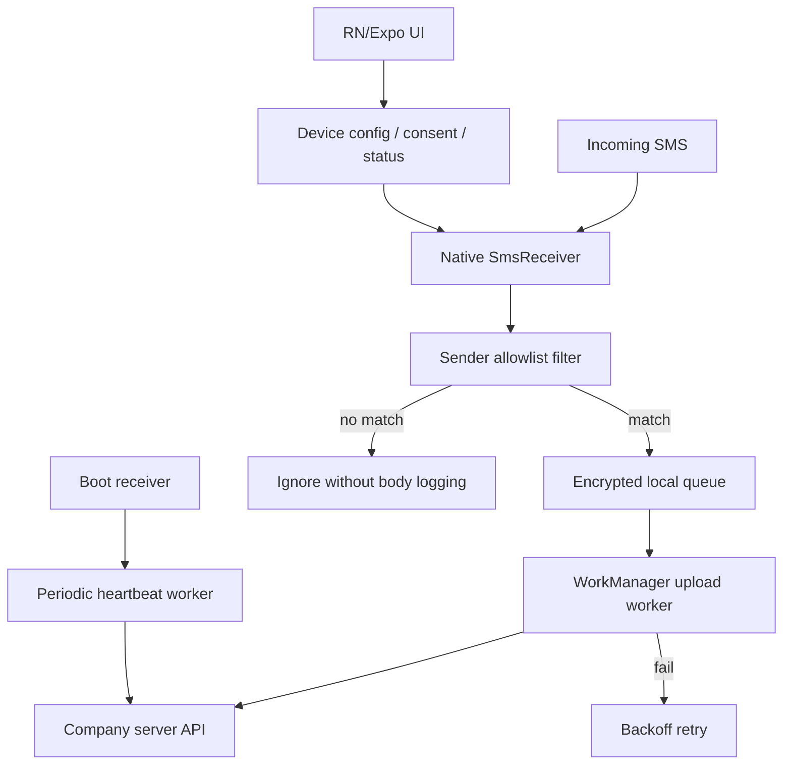

# Android 특정번호 SMS 서버 전달 앱 리서치

작성일: 2026-06-08 KST
질문: 회사 Android 휴대폰에서 특정 번호로 오는 문자를 서버로 발송하고, keep alive 신호로 서비스 정상 동작 여부를 계속 보고하는 앱을 React Native / Expo Go 등으로 만들 수 있는가?

## 결론

가능하다. 다만 `Expo Go`만으로는 안 된다. SMS 수신은 Android의 민감 권한, manifest 등록, `BroadcastReceiver`, 백그라운드 작업, 재부팅 후 복구 같은 네이티브 Android 영역이 필요하다.

현실적인 선택지는 2가지다.

1. **Expo development build + local Expo module/config plugin**
   - UI와 설정 화면은 React Native/Expo로 만든다.
   - SMS 수신기, 권한, WorkManager, boot receiver는 Kotlin/Java 네이티브 모듈로 구현한다.
   - Expo Go가 아니라 회사용으로 빌드한 자체 앱을 설치한다.

2. **Bare React Native 또는 순수 Android(Kotlin)**
   - SMS/백그라운드 안정성이 가장 중요하면 Android 네이티브 비중을 크게 둔다.
   - React Native는 설정 UI, 상태 화면, 로그 확인 UI 정도에 쓴다.

추천은 **Expo development build + Android 네이티브 모듈**이다. 서버 연동, 설정 UI, 배포 자동화는 Expo/RN의 생산성을 가져가고, SMS 수신/전송 큐/heartbeat는 Android 네이티브에서 안정적으로 처리한다.

## Expo Go 가능 여부

Expo Go는 적합하지 않다.

- Expo Go는 미리 빌드된 네이티브 앱이라 사용자가 임의의 네이티브 모듈이나 manifest receiver를 추가할 수 없다.
- Expo 공식 FAQ도 Expo Go는 Expo SDK에 포함된 라이브러리나 custom native code가 없는 라이브러리만 사용할 수 있고, 실제 프로젝트에는 development build를 권장한다고 설명한다.
- Expo의 `expo-sms`는 시스템 SMS 앱을 열어 사용자가 SMS를 보내게 하는 라이브러리다. 수신 SMS를 백그라운드에서 읽는 API가 아니다.

따라서 개발 흐름은 아래처럼 잡는 편이 맞다.

```text
React Native / Expo UI
  -> 자체 development build 설치
  -> Android native module
      -> RECEIVE_SMS permission
      -> SMS_RECEIVED BroadcastReceiver
      -> local persistent queue
      -> WorkManager upload worker
      -> periodic heartbeat worker
```

## Android SMS 수신 방식

Android에는 새 SMS가 들어왔을 때 `android.provider.Telephony.SMS_RECEIVED` broadcast를 받을 수 있는 경로가 있다. Android 공식 문서의 `Telephony.Sms.Intents.SMS_RECEIVED_ACTION`은 새 text SMS가 수신되면 등록된 receiver들에게 전달되고, `getMessagesFromIntent(Intent)`로 PDU에서 `SmsMessage[]`를 꺼낼 수 있다고 설명한다. 이 broadcast를 받으려면 `android.permission.RECEIVE_SMS`가 필요하다.

기본 구현 방향:

1. `AndroidManifest.xml`에 `RECEIVE_SMS`와 `INTERNET`을 선언한다.
2. 앱 첫 설정 시 런타임 SMS 권한을 요청한다.
3. `BroadcastReceiver`가 `SMS_RECEIVED_ACTION`을 받는다.
4. `SmsMessage.originatingAddress`를 정규화해서 허용 발신번호 allowlist와 비교한다.
5. 일치하는 SMS만 로컬 큐에 저장한다.
6. 즉시 네트워크 전송을 시도하되, 실패하면 WorkManager one-time work로 재시도한다.
7. 서버 ACK를 받은 뒤 큐 항목을 delivered 상태로 바꾼다.

`READ_SMS`는 과거 SMS inbox 전체를 읽거나 백필해야 할 때 필요하다. 이 요구사항은 "새로 들어오는 특정 번호의 SMS 전달"이므로 우선 `RECEIVE_SMS`만으로 설계하는 편이 권한 최소화에 맞다.

## 권한과 배포 리스크

SMS 권한은 일반 런타임 권한보다 민감하다.

- Android 공식 permission 문서는 `RECEIVE_SMS`, `READ_SMS`, `SEND_SMS`를 `dangerous` 권한으로 표시하고, hard restricted permission이므로 installer allowlist 없이는 보유할 수 없다고 설명한다.
- Google Play 정책은 SMS/Call Log 권한을 high-risk/sensitive 권한으로 제한하고, 권한 사용이 앱의 핵심 기능이어야 하며 Play Console declaration/review 대상이라고 설명한다.
- Google Play 정책상 기업 아카이브, 기업 CRM, enterprise device management는 예외 후보에 들어간다. 단, review/승인 대상이고 앱 설명, 개인정보 처리, 명시적 고지와 동의가 필요하다.

회사 휴대폰이고 직원 동의가 있어도, 앱 배포 경로는 신중하게 정해야 한다.

권장 배포 경로:

1. **Managed Google Play private app**
   - 회사 조직에만 공개되는 private app으로 배포한다.
   - Android Enterprise/EMM으로 원격 설치, 업데이트, 권한 정책, 배터리 정책을 관리할 수 있다.
   - Play의 SMS 권한 declaration/review는 여전히 고려해야 한다.

2. **내부 APK 직접 설치**
   - 빠른 PoC에는 가능하다.
   - 다만 Android/OEM/installer 버전에 따라 restricted permission grant가 막히거나 추가 설정이 필요할 수 있으므로 목표 단말에서 반드시 검증해야 한다.
   - 장기 운영에는 업데이트, 권한 회수, 감사, 분실 단말 차단이 약하다.

공개 Play Store 앱으로 배포하는 것은 이 용도에는 맞지 않는다. 외부 사용자용 앱처럼 공개하면 정책 심사와 개인정보 리스크가 커진다.

## 권장 앱 아키텍처



핵심 설계 원칙:

- SMS 수신, 큐 저장, 전송 재시도는 Android 네이티브 쪽에서 처리한다.
- React Native/Expo는 설정 UI와 상태 화면을 담당한다.
- 서버 URL, device id, 발신번호 allowlist, 인증 토큰은 앱 설정/프로비저닝으로 주입한다.
- 특정 번호 필터는 앱과 서버 양쪽에서 모두 검증한다.
- SMS 원문은 필요한 경우에만 저장하고, 로컬 큐는 암호화한다.
- 서버 전송은 idempotency key를 포함한다. 예: `device_id + sms_timestamp + sender + body_hash`.
- 네트워크 실패, 앱 프로세스 종료, 재부팅을 정상 상황으로 보고 재시도 큐를 둔다.

## Native module 책임 분리

### Android native layer

- SMS 권한 요청 상태 확인
- `BroadcastReceiver` 등록
- SMS 발신번호/본문 추출
- allowlist 필터링
- 로컬 persistent queue 저장
- WorkManager upload worker 등록
- periodic heartbeat worker 등록
- boot completed 후 heartbeat/큐 재개
- foreground notification이 필요한 경우 notification channel 관리

### React Native / Expo layer

- 최초 설정 화면
- 직원 고지/동의 확인 화면
- 서버 연결 테스트
- 추적할 발신번호 목록 표시
- 현재 권한 상태 표시
- 마지막 SMS 수신/전송/ACK 시간 표시
- heartbeat 상태 표시
- 큐 적체/전송 실패 로그 표시
- 앱 버전/단말 식별자 표시

## Heartbeat 설계

`keep alive`는 "앱 프로세스가 항상 살아있다"는 의미로 잡으면 Android에서 실패하기 쉽다. 대신 서버 관점에서 "단말이 최근에 정상 보고했는가"로 설계해야 한다.

권장 heartbeat:

- WorkManager periodic task로 15분 이상 주기 heartbeat를 보낸다.
- Android/Expo BackgroundTask 모두 periodic background work는 정확한 주기 실행을 보장하지 않는다.
- heartbeat payload에는 앱 상태를 넣는다.
  - `device_id`
  - `app_version`
  - `android_version`
  - `sms_permission_granted`
  - `notification_permission_granted`
  - `battery_optimization_status`
  - `last_sms_received_at`
  - `last_sms_forwarded_at`
  - `last_server_ack_at`
  - `pending_queue_count`
  - `last_error_code`
  - `uptime_since_boot`

서버 판정 예:

- 0-30분: 정상
- 30-60분: 지연 경고
- 60분 이상: 미보고 장애 후보
- `sms_permission_granted=false`: 즉시 조치 필요
- `pending_queue_count>0` 지속: 네트워크/API/권한 문제

실시간성이 더 필요하면 foreground service를 고려할 수 있지만, 계속 표시되는 notification이 필요하고 Android 버전별 제약이 있다. Android 15 이상에서는 일부 foreground service type에 24시간당 6시간 제한도 있으므로, 단순 heartbeat를 위해 perpetual foreground service를 쓰는 것은 권장하지 않는다.

## 백그라운드/재부팅/배터리 고려사항

SMS 수신은 이벤트 기반으로 처리하고, 전송은 큐/WorkManager 기반으로 복구 가능하게 만드는 것이 핵심이다.

- 앱이 foreground에 없어도 `SMS_RECEIVED_ACTION` receiver가 SMS 이벤트를 받을 수 있어야 한다.
- receiver 안에서 오래 걸리는 네트워크 작업을 직접 하지 말고 큐에 넣은 뒤 worker에 맡긴다.
- WorkManager는 네트워크 조건, 지수 backoff, 재부팅 후 재스케줄링에 적합하다.
- heartbeat 주기는 Android가 조절할 수 있으므로 정확한 초/분 단위 SLA로 설계하지 않는다.
- 회사 단말이면 EMM/MDM에서 배터리 최적화 예외, 앱 자동 시작, 앱 삭제 방지, 업데이트 정책을 함께 관리하는 편이 좋다.

## 대안: NotificationListenerService

SMS 권한 대신 기본 문자 앱의 알림을 `NotificationListenerService`로 읽는 우회적 구조도 가능은 하다. Android 공식 문서상 notification listener는 새 알림 posted/removed 이벤트를 받을 수 있고, `BIND_NOTIFICATION_LISTENER_SERVICE`를 manifest에 선언해야 한다.

하지만 이 요구사항의 주 구현으로는 권장하지 않는다.

- 사용자가 SMS 앱 알림을 꺼두면 수신하지 못한다.
- 잠금화면/민감 콘텐츠 숨김 설정에 따라 본문이 숨겨질 수 있다.
- Android의 민감 알림 제한이 강화되고 있다.
- "SMS 자체 수신"이 아니라 "알림에 노출된 텍스트 관찰"이라 정확성과 감사 가능성이 낮다.

따라서 PoC 보조수단은 될 수 있어도 운영용 SMS forwarding의 주 경로는 `RECEIVE_SMS` + native receiver가 맞다.

## SMS Retriever/User Consent API는 이 요구사항에 부적합

Google의 SMS Retriever API는 OTP 검증용이다. 서버가 앱 hash가 포함된 SMS를 보내고, Google Play services가 그 메시지를 앱에 전달하는 구조다. 임의의 외부 번호에서 오는 모든 문자를 조용히 받아 서버로 전달하는 용도가 아니다.

즉 이 요구사항처럼 "특정 외부 번호에서 오는 실제 업무 SMS를 자동 전달"하려면 Retriever 계열 API가 아니라 Android SMS permission/receiver 계열을 봐야 한다.

## 보안/개인정보 설계 체크리스트

직원 동의를 받았더라도, 앱은 다음을 기본값으로 가져야 한다.

- 앱 첫 화면에 수집 목적, 수집 대상 발신번호, 서버 전송 항목, 보관 기간을 명시한다.
- 앱 안에서 현재 활성 상태와 마지막 전송 시간을 항상 볼 수 있게 한다.
- allowlist에 없는 SMS는 본문을 저장하거나 서버로 보내지 않는다.
- 로컬 큐는 암호화하고, ACK 이후 원문을 즉시 삭제하거나 최소 기간만 보관한다.
- 서버 전송은 HTTPS, device-bound token, payload 서명 또는 mTLS 중 하나 이상을 사용한다.
- 서버는 중복 수신을 idempotency key로 제거한다.
- 디버그 로그에는 SMS 본문 전체를 남기지 않는다.
- 단말 분실/퇴사/동의 철회 시 서버에서 device token을 폐기할 수 있어야 한다.
- 앱 삭제/권한 해제/heartbeat 중단을 서버 대시보드에서 감지한다.

## MVP 구현 범위

1차 PoC:

- Android 1개 단말
- Expo development build 또는 bare RN
- 특정 발신번호 1개 hardcoded allowlist
- `RECEIVE_SMS` 권한 요청
- SMS 수신 시 로컬 큐 저장
- 서버 test endpoint로 POST
- 실패 시 WorkManager 재시도
- 15분 heartbeat
- 앱 화면에 권한/마지막 전송/마지막 heartbeat 표시

2차 운영화:

- 서버에서 device provisioning token 발급
- allowlist 원격 설정
- encrypted local queue
- boot receiver
- EMM/Managed Google Play private app 배포 검증
- Android 13/14/15/16 및 주요 제조사 단말 테스트
- Play/Managed Play SMS permission declaration 준비
- 장애 대시보드와 알림

## 테스트 매트릭스

최소 검증해야 할 항목:

| 항목 | 기대 결과 |
|---|---|
| 앱 foreground 상태에서 SMS 수신 | allowlist 번호만 서버 전송 |
| 앱 background 상태에서 SMS 수신 | 동일하게 전송 또는 큐 저장 후 전송 |
| 앱 task 제거 후 SMS 수신 | 목표 Android/OEM에서 receiver 동작 확인 |
| 단말 재부팅 후 | heartbeat 재개, 큐 전송 재개 |
| 네트워크 끊김 | 큐 적재, 복구 후 전송 |
| 서버 500/timeout | backoff 재시도, 중복 방지 |
| SMS 권한 해제 | heartbeat에 권한 오류 보고 |
| 배터리 최적화 적용 | heartbeat 지연/receiver 영향 확인 |
| allowlist 외 번호 | 본문 저장/전송 없음 |
| 앱 업데이트 | receiver/worker/권한 유지 |

## 공식 문서 근거

- Expo development builds: Expo Go는 fixed native libraries만 포함하고, 새 native library나 앱 설정 변경에는 자체 native app/development build가 필요하다고 설명한다.
  <https://docs.expo.dev/develop/development-builds/introduction/>
- Expo FAQ: Expo Go는 custom native code를 직접 사용할 수 없고 production-grade 프로젝트에는 development build를 권장한다고 설명한다.
  <https://docs.expo.dev/faq/>
- Expo SMS: `expo-sms`는 system UI/app을 열어 SMS를 보내는 기능이며 수신 SMS listener가 아니다.
  <https://docs.expo.dev/versions/latest/sdk/sms/>
- Expo custom native code: local Expo module과 config plugin으로 AndroidManifest 등 네이티브 설정을 적용하는 경로를 제공한다.
  <https://docs.expo.dev/workflow/customizing/>
- Android `Telephony.Sms.Intents`: `SMS_RECEIVED_ACTION`과 `getMessagesFromIntent(Intent)`로 수신 SMS를 처리할 수 있고 `RECEIVE_SMS`가 필요하다고 설명한다.
  <https://developer.android.com/reference/android/provider/Telephony.Sms.Intents>
- Android `Manifest.permission`: `RECEIVE_SMS`, `READ_SMS`, `SEND_SMS`는 dangerous/hard restricted 성격의 SMS 권한이다.
  <https://developer.android.com/reference/android/Manifest.permission>
- Android services/foreground services: foreground service는 사용자에게 보이는 notification이 필요하며 background start/foreground service type 제약이 있다.
  <https://developer.android.com/develop/background-work/services>
  <https://developer.android.com/develop/background-work/services/fgs>
- Android WorkManager long-running/periodic work: WorkManager는 foreground service와 JobScheduler 기반으로 동작하고, periodic work는 최소 15분 간격이며 정확한 실행 시각을 보장하지 않는다.
  <https://developer.android.com/develop/background-work/background-tasks/persistent/how-to/long-running>
  <https://developer.android.com/develop/background-work/background-tasks/persistent/getting-started/define-work>
- Expo BackgroundTask: Android에서는 WorkManager 기반이며 최소 interval 15분, 시스템이 실제 실행 시점을 조절한다고 설명한다.
  <https://docs.expo.dev/versions/latest/sdk/background-task/>
- Google Play SMS/Call Log policy: SMS/Call Log 권한은 high-risk/sensitive 권한이고 permitted uses/exception/review/declaration 대상이다.
  <https://support.google.com/googleplay/android-developer/answer/10208820>
- Managed Google Play private apps: 조직 내부 사용자에게만 private app을 배포할 수 있다.
  <https://support.google.com/work/android/answer/9563481>
  <https://support.google.com/googleplay/android-developer/answer/9874937>
- SMS Retriever API: OTP/전화번호 검증용이며 앱 hash가 포함된 SMS를 받는 흐름이다.
  <https://developers.google.com/identity/sms-retriever/overview>
  <https://developer.android.com/identity/sms-retriever>
- React Native Headless JS: Android에서 background 상태의 JS task 실행 경로가 있지만, 네이티브 service와 결합해야 한다.
  <https://reactnative.dev/docs/headless-js-android>
- Android `NotificationListenerService`: 알림 posted/removed 이벤트를 받는 서비스이며 manifest에 `BIND_NOTIFICATION_LISTENER_SERVICE`가 필요하다.
  <https://developer.android.com/reference/android/service/notification/NotificationListenerService>
