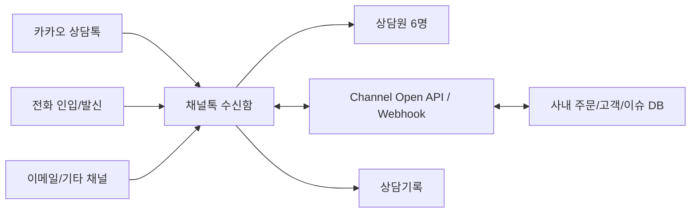

# 채널톡 상담/전화/API 리서치

작성일: 2026-06-08
목적: Zendesk/MatrixChat 대체 후보로 채널톡을 검토한다. 특히 카카오 상담톡, 전화 수발신, 상담 기록, 통화 전사, AI 미사용 운영, 기존 이슈 API 등록 가능성을 확인한다.

## 결론

채널톡은 Zendesk 대체 후보로 꽤 적합하다. 카카오 상담톡 공식딜러사 목록에 채널코퍼레이션이 올라와 있고, 채널톡 문서도 카카오 상담톡/알림톡/브랜드 메시지 연동을 지원한다고 안내한다. 전화도 채널톡 안에서 수신/발신하고, 전화 상담이 수신함 상담으로 남으며, 통화 종료 후 자동 녹음과 텍스트 변환이 제공된다.

다만 사용자가 원하는 조건 중 다음 2개는 공개 문서만으로는 확정되지 않았다.

- 사람 상담원이 받는 일반 전화 상담의 "실시간 전사" 제공 여부
- 전화 녹음 파일, STT 전사문, 전화 상담 상세 데이터를 Open API로 실시간/배치 조회할 수 있는지

공식 문서 기준으로 확인된 것은 "전화 상담은 새 상담으로 열림", "전화는 음성 텍스트 변환/녹음/요약 지원", "통화 종료 후 녹음/텍스트 변환", "수신함에서 검색", "mp3 다운로드", "상담 통계 raw data 다운로드/Tableau 연동"이다. ALF 전화는 실시간 텍스트 확인을 홍보하지만, 사용자가 요구한 조건은 AI 응답 금지이므로 ALF 전화는 제외해야 한다.

따라서 현재 판단은 다음과 같다.

- Zendesk 대체 + 카카오 상담 + 전화 상담 기록 통합: 가능성이 높다.
- 전화 인입을 상담으로 남기기: 가능.
- 전화 녹음/통화 후 STT: 가능.
- AI 응답 없이 운영: 가능. 단 ALF 전화/고객 ALF/자동 응답 워크플로우를 켜지 않도록 운영 설계 필요. STT는 "응답"이 아니라 기록 기능이므로 별도 허용 여부를 정책으로 정하면 된다.
- 기존 이슈를 API로 채널톡 상담에 등록: 일부 가능. 고객(User) upsert, UserChat 생성, UserChat에 bot 메시지 발송, 메시지/상담 조회 API가 있다. 다만 "이슈 관리 시스템"처럼 과거 이슈를 원본 날짜 그대로 backfill하거나 상담 설명/태그/담당자까지 완전 제어하는 API가 있는지는 추가 확인 필요.

## 요구사항별 확인

### 1. 카카오 상담톡을 채널톡에서 운영

채널톡 문서는 카카오톡과 연동하면 고객은 카카오톡에서 문의하고 상담원은 채널톡에서 응대할 수 있다고 안내한다. 알림톡으로 이탈 고객에게 답변 알림을 보내고, 마케팅 기능과 연결해 정보성 메시지를 자동 발송할 수 있다고도 설명한다.

카카오 공식 상담톡 문서의 공식딜러사 목록에도 채널코퍼레이션이 포함되어 있다.

주의:

- 카카오 상담톡 이전 상담 내역은 카카오 정책상 채널톡으로 연동되지 않는다고 채널톡 문서가 안내한다.
- 채널톡과 연동한 시점부터 상담 기록이 채널톡에 저장된다.
- 카카오 상담톡은 고객 메시지에 매니저가 첫 답변을 보내거나 워크플로우 자동 메시지가 전송되는 시점 등에 과금된다.

### 2. 전화 수발신을 채널톡에서 제어

확인된 기능:

- 채널톡 전화 기능은 070 번호를 발급해 사용할 수 있다.
- 기존 고객센터 대표번호/일반번호/인터넷번호/휴대폰 번호를 채널톡 070 번호로 착신전환할 수 있다.
- 기존 번호로 발신번호 변경도 신청할 수 있다. 단 010 번호는 발신 번호 변경이 불가하다고 안내된다.
- 기존 유선 전화기를 SIP로 연동할 수 있다.
- PC/모바일에서 발신 가능하다.
- 신규 고객 번호를 직접 입력해 발신할 수 있고, 기존 고객 프로필/수신함에서 전화할 수 있다.
- IVR로 문의 유형을 받고 담당 팀/담당자에게 라우팅할 수 있다.

필수 조건:

- 전화 기능은 비즈니스 인증 완료 채널에서 사용 가능하다.
- 전화 상담원이 받으려면 오퍼레이터 시트와 전화 배정 가능 상태가 필요하다.

### 3. 전화 인입 시 상담 기록 남기기

확인됨. 채널톡 전화 문서에 따르면 고객과의 전화는 채팅 상담과 동일하게 수신함에 표시된다. 고객 연락처에 존재하는 번호로 전화가 오면 고객 정보가 연동되고, 없는 번호면 새로운 리드로 저장된다. 내부 대화에 메모를 남기거나 팀원을 초대할 수 있고, 태그/담당자/팀 배정 워크플로우도 동작한다.

수신함 문서는 채널톡 메시지, 전화, 이메일, 카카오 상담톡, 인스타그램 DM, 네이버 톡톡, LINE으로 인입된 상담 내역을 분리해 확인할 수 있다고 설명한다. 상담 정보 영역에는 캠페인/워크플로우 유입 정보, 상담 목표, 상담 태그, 상담 설명, 고객 정보, 이벤트와 이전 상담 목록이 표시된다.

### 4. 통화 녹음과 전사

확인된 기능:

- 전화는 채널톡 번호와 고객 전화번호를 연결하며, 새로운 상담으로 열린다.
- 전화로 열린 상담은 통화 상담으로 분류된다.
- 통화 종료 후 자동으로 내용이 녹음된다.
- 통화 종료 후 텍스트로 변환된다.
- 채널톡의 미트 비교표 기준으로 전화는 음성 텍스트 변환, 녹음, 요약을 지원한다.
- 녹음 및 텍스트 변환은 최대 1시간까지만 지원된다.
- 녹음된 통화는 재생 및 mp3 다운로드가 가능하다.
- 텍스트 변환 내용은 수신함에서 키워드 검색 및 재확인이 가능하다.

불확실한 점:

- 사람 상담원이 받는 일반 전화 상담 중 실시간 전사가 가능한지는 공식 사용 가이드에서 확인되지 않았다.
- 채널톡 전화 제품 소개 페이지에는 STT와 "ALF와 고객의 통화는 실시간 텍스트로 확인" 문구가 있지만, 이는 ALF 전화 맥락이다. AI 응답을 쓰지 않는 운영에서는 해당 실시간 전사 기능을 그대로 쓸 수 있는지 별도 확인이 필요하다.
- 녹음 파일/mp3, 전사 텍스트를 Open API로 가져오는 엔드포인트는 공개 Open API 문서 검색에서 확인되지 않았다. UI 다운로드, 수신함 검색, 통계 raw data/Tableau 연동은 확인된다.

### 5. AI 응답 금지 운영

가능하다. 단 설정상 아래 기능을 의도적으로 끄거나 제한해야 한다.

- 고객 ALF
- ALF 전화
- 워크플로우의 자동 답변/자동 메시지
- 카카오 상담톡 첫 응답을 자동 워크플로우가 보내는 설정
- AI 상담 요약까지 금지할 정책이라면 [AI] - [AI 부가 기능] - [상담 요약]도 OFF로 둔다.

허용할 수 있는 자동화:

- IVR 안내 및 라우팅
- 담당팀/담당자 배정
- 상담 태그 부착
- 문자 안내만 필요한 경우에도 자동 발송 여부를 정책적으로 검토
- STT/녹음은 고객에게 응답하지 않는 기록 기능이므로, 개인정보/녹취 고지 정책에 맞춰 별도 허용할 수 있다.

운영 정책:

- "AI가 고객에게 응답하지 않는다"를 채널톡 설정 점검표로 만들어야 한다.
- 워크플로우는 라우팅/태깅/콜백 정보 수집까지만 사용한다.
- 자동 메시지를 켜면 카카오 상담톡 과금과 고객 응답 경험에 영향을 줄 수 있으므로 승인 절차를 둔다.

## API 확인

### 상담 조회/생성/메시지

공개 Channel Developers 문서에서 확인된 Open API:

- `GET /open/v5/user-chats`: managed 상태의 UserChat 목록 조회.
- `GET /open/v5/user-chats/{userChatId}`: 특정 UserChat 조회.
- `GET /open/v5/user-chats/{userChatId}/messages`: 특정 상담의 메시지 목록 조회.
- `POST /open/v5/users/{userId}/user-chats`: 특정 User의 UserChat 생성.
- `GET /open/v5/users/{userId}/user-chats`: 특정 User의 UserChat 목록 조회.
- `POST /open/v5/user-chats/{userChatId}/messages`: UserChat에 bot 메시지 발송.
- `PATCH /open/v5/user-chats/{userChatId}/invite`: 특정 UserChat에 매니저 초대.
- `PATCH /open/v5/user-chats/{userChatId}/close`: UserChat 종료.

즉 상담 데이터를 읽고, 특정 고객에게 새 상담을 만들고, bot 메시지를 넣는 흐름은 가능해 보인다.

### 고객 정보

공개 Open API에서 확인된 기능:

- `PUT /open/v5/users/@{memberId}`: 회사의 memberId 기준으로 User가 있으면 업데이트, 없으면 생성.
- `PATCH /open/v5/users/{userId}`: User profile/profileOnce/tags/수신거부 상태 업데이트.
- `GET /open/v5/users/{userId}` 또는 memberId 기준 조회.
- `DELETE /open/v5/users/{userId}` 또는 memberId 기준 삭제.

기존 고객/주문/이슈 데이터와 채널톡 고객 프로필을 연결하려면 `memberId`를 회사 내부 고객 ID로 통일하는 것이 중요하다.

### Webhook

공개 문서 기준:

- Webhook은 채널에서 이벤트가 발생했을 때 등록된 URL로 POST 요청을 보내는 기능이다.
- UserChat 또는 team chat에서 메시지가 생성될 때 알림을 받을 수 있다.
- 새 UserChat 생성, User upsert 관련 이벤트도 문서에 언급된다.
- Quick-reply로 Webhook 응답에 바로 bot 답변을 넣는 기능이 있다.

우리 정책상 AI 응답 금지라면 Quick-reply는 자동응답 용도로 사용하지 않는다. 대신 webhook은 사내 시스템 동기화, 알림, 로그 저장에만 사용한다.

### 기존 이슈를 채널톡에 API로 등록

가능한 설계:

1. 내부 고객 ID를 `memberId`로 하여 Channel User를 upsert한다.
2. 고객 profile에 주문번호, 고객등급, 최근 주문일, 내부 고객 URL 등 필요한 정보를 넣는다.
3. 기존 미해결 이슈별로 UserChat을 생성한다.
4. UserChat에 bot 메시지로 이슈 요약을 넣는다.
5. 메시지 본문에 원본 이슈 ID, 생성일, 상태, 담당자, 링크, 최근 메모를 구조화해 넣는다.
6. 필요하면 manager invite로 담당자를 참여시킨다.
7. 상담 태그/설명/담당자 배정의 API 지원 범위는 실제 계정 API 문서 또는 테스트로 확인한다.

주의:

- 채널톡은 Jira/Linear 같은 이슈 트래커가 아니라 고객 상담 도구다.
- 과거 이슈를 원본 생성 시각 그대로 상담 타임라인에 backdate하는 API는 공개 문서에서 확인되지 않았다.
- `POST /messages`는 bot 메시지 발송 API라, "상담원이 과거에 쓴 것처럼" import하는 것은 어려울 수 있다.
- 고객에게 실제 알림이 나가지 않게 import할 수 있는지 반드시 테스트해야 한다.
- 대량 등록 시 고객에게 알림톡/문자/푸시가 나가는 설정이 있는지 확인해야 한다.

## 전화 데이터 API 한계

공개 문서에서 확인된 것은 다음이다.

- 상담 통계 raw data 다운로드 시 `UserChat meet data` 탭에서 inbound/outbound/missed 콜, duration 등을 볼 수 있다.
- 전화별 통계에는 `userChatId`, `startedAt`, `endedAt`, `engagedAt`, `from`, `to`, `direction`, `missedReason`, `duration`, `type`, `primaryNumber`, `representativeNumber` 같은 항목이 있다.
- Tableau 연동은 Access Key/Secret을 사용해 최대 90일 데이터를 제공한다고 안내된다.

아직 확인되지 않은 것:

- 전화 call history를 Open API로 직접 조회하는 public endpoint.
- 통화 녹음 mp3 URL을 API로 조회하는 endpoint.
- STT 전사문을 API로 조회하는 endpoint.
- 전화 인입/종료/녹음완료/STT완료 webhook.

따라서 계약 전 채널톡에 이 항목을 직접 확인해야 한다.

## 엔터프라이즈 플랜과 비용 추정

2026-06-08 기준 채널톡 가격표와 구독 가이드상 연매출 100억 이상 기업은 엔터프라이즈 플랜 구독이 필요하다. 공개 가격표에서 엔터프라이즈의 MU, 기본 시트, 오퍼레이터 시트는 모두 "문의"로 표시되며, 정가가 공개되어 있지 않다. 따라서 아래 금액은 견적 전 예산 산정용 추정이다.

### 그로스 플랜 대비 달라지는 점

그로스에서도 전화, 고객 메신저, 상담 태그/목표/기본 통계, 커스텀 리포트, 상담 자동 배정, 팔로업 알림, 도큐먼트, 모바일 SDK, Open API/Webhook 자체는 제공된다. 따라서 엔터프라이즈가 필수인 이유는 기능 하나 때문이라기보다 회사 규모, 계약 조건, 보안/지원 요건 때문이다.

엔터프라이즈에서 중요하게 달라지는 영역:

- 연매출 100억 이상 기업은 엔터프라이즈 구독 필요. 맞지 않는 플랜 사용 시 제한 가능.
- MU, 기본 시트, 오퍼레이터 시트가 공개 단가가 아니라 견적/계약 조건으로 바뀐다.
- SAML SSO, 세션 타임아웃, IP 주소 제한, 정보 수정/삭제 이력 관리 같은 보안 패키지를 사용할 수 있다. 보안 패키지는 엔터프라이즈에서 별도 구독/선불 충전 후 사용 가능한 것으로 안내된다.
- 역할/권한, 민감정보 마스킹, 다중 인증, 이상 행위 탐지, 규정 준수 로그 등 엔터프라이즈급 보안 운영을 강조한다.
- 1:1 맞춤형 온보딩과 전담 지원이 제공된다.

### 비교용 하한선: 그로스 공개 단가로 계산하면

연매출 조건만 없다고 가정하고, 상담원 6명을 그로스 공개 단가로 계산하면 다음이 하한선이다.

- 그로스 기본료: 90,000원/월, 연 결제 25% 할인 기준.
- 기본 시트: 5개 포함, 6명 모두 팀 멤버라면 1개 추가 = 3,000원/월.
- 오퍼레이터 시트: 1개 포함, 상담원 6명이라면 5개 추가 = 300,000원/월.
- 합계: 393,000원/월, VAT 별도.
- 연간: 4,716,000원/VAT 별도, 5,187,600원/VAT 포함.

이 금액은 엔터프라이즈 견적의 "최소 비교선"일 뿐이다. 연매출 100억 이상이면 실제 계약은 엔터프라이즈 견적을 받아야 한다.

### 엔터프라이즈 예산 추정

상담원 6명, 카카오 상담톡, 전화, Open API/Webhook, AI 응답 미사용 기준으로 보면 다음 정도를 예산 범위로 잡는 것이 현실적이다.

| 항목 | 낮은 추정 | 현실적 추정 | 높은 추정 |
| --- | ---: | ---: | ---: |
| 엔터프라이즈 기본 구독/시트/MU | 800,000원/월 | 1,200,000~2,000,000원/월 | 2,000,000원+/월 |
| 카카오 상담톡 사용량 | 80,000원/월 | 80,000~240,000원/월 | 240,000원+/월 |
| 전화번호/발신 통화료 | 50,000~150,000원/월 | 150,000~400,000원/월 | 400,000원+/월 |
| 보안 패키지 | 견적 필요 | 견적 필요 | 견적 필요 |

연간 예산 감:

- 최소 예산선: 약 1,200만~1,600만원/년, VAT 포함.
- 현실적 예산선: 약 1,800만~3,500만원/년, VAT 포함.
- 보안 패키지, MU 대량, 발신 통화량, 카카오 상담량이 많으면 4,000만원/년 이상도 가능.

내부 예산을 먼저 잡아야 한다면 6명 상담 조직 기준으로는 연 2,500만원 내외를 1차 예산으로 잡고, 채널톡 견적에서 보안 패키지와 전화/STT/API 접근 조건을 확인하는 것이 적절하다.

## 도입 옵션 나열

아래는 채널톡 엔터프라이즈를 전제로, 어떤 기능을 넣고 빼느냐에 따른 선택지다. 연매출 100억 이상이면 기본 플랜은 엔터프라이즈 견적을 받아야 하므로, 금액은 모두 견적 전 예산 추정이다.

### 옵션 A. 카카오 상담톡 + 웹채팅만 사용

구성:

- 채널톡 엔터프라이즈
- 카카오 상담톡 연동
- 웹사이트 채널톡 버튼/고객 메신저
- Open API/Webhook 최소 연동
- 전화는 기존 통신/전화 시스템 유지
- AI 응답 없음

장점:

- 가장 단순하다.
- Zendesk/MatrixChat에서 하던 카카오 상담 응대는 비교적 빠르게 이전 가능하다.
- 전화 전환 리스크가 없다.
- 상담원 6명 기준으로 운영 변경 부담이 낮다.

단점:

- 전화 상담 기록이 채널톡에 자동으로 남지 않는다.
- 전화 인입 후 상담 메모를 수동으로 남겨야 한다.
- 전화 녹음/STT/검색을 채널톡에서 못 쓴다.
- 고객 히스토리가 채팅과 전화로 갈라진다.

예산 감:

- 엔터프라이즈 기본 구독 + 카카오 상담톡 사용량.
- 전화 비용은 기존 시스템 비용 유지.
- 연간 약 1,200만~2,500만원대부터 시작할 가능성.

적합한 경우:

- 우선 Zendesk만 빨리 걷어내고 싶을 때.
- 전화 상담 비중이 낮거나, 기존 전화 시스템을 당장 바꾸기 어렵다면 1차 단계로 적합하다.

### 옵션 B. 카카오 상담톡 + 채널톡 전화까지 통합

구성:

- 옵션 A 전체
- 채널톡 전화 번호 발급 또는 기존 대표번호 착신전환
- 상담원 6명 오퍼레이터 시트
- 전화 인입/발신을 채널톡에서 처리
- 통화 녹음/STT/수신함 기록 사용
- AI 응답 없음

장점:

- 채팅, 카카오 상담톡, 전화가 같은 수신함에 모인다.
- 전화 인입이 새 상담으로 남는다.
- 통화 녹음과 텍스트 변환을 상담 기록으로 활용할 수 있다.
- 전화 후처리, 담당자 배정, 태그, 내부 메모 운영이 쉬워진다.
- 기존 CTI/전화기 의존도를 낮출 수 있다.

단점:

- 대표번호 착신전환/발신번호 표시/통화품질 테스트가 필요하다.
- 전화 데이터 API가 공개 문서상 완전히 확인되지 않았다.
- 통화 녹음 mp3/STT 원문을 API로 가져올 수 있는지 견적 단계에서 확인해야 한다.
- 전화 장애 시 채널톡 의존도가 커진다.

예산 감:

- 옵션 A 대비 전화번호 월 9,000원/개 + 발신 통화료가 추가된다.
- 발신 통화료는 무선 72원/분, 유선 15원/분 기준.
- 내부 예산으로는 연간 180만~500만원 정도를 전화 관련 변동비로 따로 잡는 것이 안전하다. 발신량이 많으면 더 커진다.
- 전체 연간 약 1,800만~3,500만원대가 현실적인 1차 예산.

적합한 경우:

- 전화 상담이 고객 경험에서 중요할 때.
- 상담 기록을 한곳에 모으는 것이 목표라면 이 옵션이 가장 현실적이다.

### 옵션 C. 전화는 넣되, 실시간 전사는 포기

구성:

- 옵션 B와 동일
- 실시간 전사는 요구사항에서 제외
- 통화 종료 후 STT/녹음/검색만 사용

장점:

- 공개 문서로 확인된 범위에 가깝다.
- 도입 가능성이 가장 높다.
- 상담원은 통화 중 응대에 집중하고, 종료 후 기록을 확인하면 된다.

단점:

- 통화 중 실시간으로 텍스트를 보면서 대응하는 운영은 어렵다.
- 실시간 모니터링/품질관리 요구가 강하면 부족할 수 있다.

예산 감:

- 옵션 B와 거의 동일.
- 별도 실시간 전사 솔루션을 붙이지 않으므로 추가 개발/외부 STT 비용이 줄어든다.

적합한 경우:

- "실시간"보다 "상담 기록 보존/검색/후처리"가 더 중요할 때.
- 현재 요구사항에서는 가장 무난한 타협안이다.

### 옵션 D. 채널톡 전화 + 외부 STT/통화 분석 별도 구축

구성:

- 옵션 B
- 녹음 파일 또는 통화 스트림을 외부 STT/분석 시스템으로 전송
- 사내 DB에 전사문/상담 요약/품질지표 저장
- 고객에게 AI 응답은 하지 않음

장점:

- 채널톡의 실시간 전사/API 한계를 우회할 수 있다.
- 전사문을 사내 이슈/주문/CRM 데이터와 더 깊게 연결할 수 있다.
- 향후 자체 품질관리, 상담 교육, 검색 시스템을 만들기 좋다.

단점:

- 채널톡에서 녹음 파일 또는 스트림을 API로 제공해야 한다. 이게 안 열리면 자동화가 막힌다.
- 개인정보/녹취/전사 데이터 처리 정책이 복잡해진다.
- 개발과 운영 비용이 생긴다.

예산 감:

- 채널톡 비용 + 외부 STT/API/저장 비용 + 개발비.
- 1차 개발만 해도 최소 2~6주 이상 잡아야 한다.
- 연간 운영비는 통화량에 따라 달라진다.

적합한 경우:

- 상담 녹취/전사 데이터가 회사의 핵심 자산이 될 때.
- 단순 상담 도구를 넘어 사내 AX/CRM 분석까지 가려는 경우.

### 옵션 E. 기존 이슈/주문 정보를 API로 채널톡에 밀어 넣기

구성:

- 옵션 A 또는 B
- Channel User를 내부 고객 ID(memberId)로 upsert
- 고객 profile에 주문/계약/등급/내부 링크 저장
- 미해결 이슈를 UserChat 또는 bot 메시지로 등록
- Webhook으로 신규 상담을 사내 DB에 동기화

장점:

- 상담원이 채널톡 화면에서 고객 맥락을 바로 볼 수 있다.
- 기존 Zendesk 이슈나 사내 이슈를 전환하는 데 도움이 된다.
- 사내 시스템과 채널톡 사이의 최소 연결고리가 생긴다.

단점:

- 과거 이슈를 원본 날짜 그대로 backdate하는 API는 확인되지 않았다.
- import 시 고객에게 알림이 나가지 않게 할 수 있는지 테스트가 필요하다.
- 채널톡을 이슈 트래커처럼 쓰면 한계가 있다.

예산 감:

- 채널톡 Open API/Webhook은 플랜에 포함된 기능으로 보인다.
- 내부 개발비가 핵심이다.
- 샘플 import/동기화 MVP는 1~3주, 안정화까지는 4~8주 정도로 보는 것이 현실적이다.

적합한 경우:

- 상담원이 주문/계약/이슈 맥락을 매번 다른 시스템에서 찾는 일이 많을 때.
- Zendesk 해지 전에 기존 데이터 일부를 옮겨야 할 때.

### 옵션 F. 보안 패키지 포함

구성:

- 옵션 A/B/E 중 선택
- SAML SSO
- 세션 타임아웃
- IP 주소 제한
- 정보 수정/삭제 이력 관리
- 역할/권한 정책 강화

장점:

- 연매출 100억 이상 기업의 보안/감사 요구에 맞추기 좋다.
- 퇴사자/외부 접속/계정 공유 리스크를 줄인다.
- 개인정보와 상담 기록을 다루는 조직이면 설득력이 높다.

단점:

- 별도 견적/구독/선불 충전이 필요하다고 문서에 안내된다.
- 사내 IdP, 허용 IP, 권한 체계 정리가 필요하다.
- 도입 초기에 설정/운영 부담이 있다.

예산 감:

- 공개 정가 없음.
- 내부 예산상 연 300만~1,200만원 정도를 별도 버퍼로 잡고 견적 확인하는 것이 안전하다.

적합한 경우:

- 고객 개인정보/통화 녹음/상담 이력을 민감 데이터로 관리해야 할 때.
- SSO/IP 제한이 회사 보안 정책상 필수라면 빼기 어렵다.

### 옵션 G. AI 응답은 금지, AI 후처리만 허용

구성:

- 고객 ALF/ALF 전화/자동 응답은 OFF
- 통화 STT, 녹음, 상담 요약 같은 후처리 기능은 허용
- 상담원은 사람만 응답

장점:

- "AI가 고객에게 답하지 않는다"는 정책을 지키면서도 기록/검색 효율을 얻을 수 있다.
- 전화 상담 후처리 시간을 줄일 수 있다.

단점:

- AI 요약도 개인정보 처리/내부 정책상 민감할 수 있다.
- 요약 품질을 사람이 검수해야 한다.
- 채널톡의 AI 상담 후처리 가격/제공 범위가 변동될 수 있다.

예산 감:

- 통화 STT/녹음은 전화 기능에 포함되는 것으로 안내된다.
- AI 상담 후처리는 가격표상 출시 예정으로 표시되어 있어 견적 확인 필요.

적합한 경우:

- 고객 응답 자동화는 싫지만 상담 기록 자동화는 필요한 경우.

### 옵션 H. AI 응답까지 사용

구성:

- 고객 ALF 또는 ALF 전화 사용
- FAQ/도큐먼트 기반 자동 응답
- 필요 시 상담원 연결

장점:

- 반복 문의를 줄일 수 있다.
- 야간/휴일 1차 응대가 가능하다.

단점:

- 현재 요구사항인 "AI 응답 금지"와 충돌한다.
- 카카오 상담톡/전화에서 잘못 응답했을 때 브랜드 리스크가 있다.
- 초기 지식 정리, 규칙 설정, 검수 비용이 크다.

예산 감:

- 고객 ALF는 가격표상 채팅 ALF 상담 참여당 500원으로 안내된다.
- 고객 응답 자동화를 쓰지 않는 현재 계획에서는 제외하는 것이 맞다.

적합한 경우:

- 나중에 반복 FAQ가 충분히 정리되고, 오답 리스크를 감수할 준비가 됐을 때.

### 옵션 I. 채널톡 없이 직접 구축

구성:

- 카카오 상담톡 공식 딜러사 API 계약
- 자체 상담 콘솔
- 자체 전화/CTI 또는 VoIP 연동
- 외부 STT 연동
- 자체 이슈/고객 DB

장점:

- 상담 흐름과 데이터 제어권을 가장 많이 가져온다.
- 사내 주문/계약/이슈 시스템에 맞춘 화면을 만들 수 있다.
- 장기적으로 제품화 가능성이 있다.

단점:

- 카카오 상담톡 원천 API가 완전 self-service가 아니므로 딜러사/API 계약에 묶인다.
- 전화/녹취/STT/권한/감사로그/상담 UI를 모두 직접 책임져야 한다.
- Zendesk 해지 대체 목적이면 일정 리스크가 크다.

예산 감:

- 라이선스 비용은 줄어도 개발비가 훨씬 커진다.
- MVP만 해도 2~4개월, 운영 안정화까지는 그 이상 잡아야 한다.
- 내부 개발 인건비까지 보면 첫해 비용은 채널톡보다 높을 가능성이 크다.

적합한 경우:

- 상담 시스템 자체가 회사 핵심 제품/경쟁력이 될 때.
- 단순 비용 절감 목적이면 비추천.

### 추천 조합

현 상황에서 가장 현실적인 조합:

1. 1차: 옵션 B + E, 즉 채널톡 엔터프라이즈 + 카카오 상담톡 + 전화 + API/Webhook 동기화.
2. 보안 요구가 있으면 옵션 F를 처음부터 포함한다.
3. AI는 옵션 G까지만 허용한다. 고객 응답 AI는 쓰지 않는다.
4. 실시간 전사는 옵션 C로 낮춰 잡고, 채널톡이 API/실시간 전사를 제공하지 않으면 옵션 D는 2차 과제로 둔다.

가장 작게 시작하는 조합:

1. 옵션 A + E.
2. 전화는 기존 시스템 유지.
3. 카카오 상담과 웹채팅만 먼저 채널톡으로 옮긴다.
4. 1~2개월 운영 후 전화까지 옮길지 결정한다.

한 번에 끝내는 조합:

1. 옵션 B + E + F + G.
2. 연간 예산은 2,500만~4,000만원 범위로 잡고 견적 협상한다.
3. 계약 전 전화 STT/API, import 무알림, 보안 패키지 비용을 반드시 문서로 확인한다.

### AI/STT를 모두 제외하는 조합

사용자 조건을 "AI 응답 없음"이 아니라 "AI 기능과 STT 기능을 모두 제외"로 강화하면 옵션이 단순해진다.

남는 핵심 기능:

- 카카오 상담톡 응대
- 웹채팅/수신함
- 상담원 배정, 태그, 내부 메모
- 기존 이슈/주문/고객정보 API 연동
- 선택적으로 전화 수발신과 통화 기록

빠지는 기능:

- 고객 ALF
- ALF 전화
- AI 상담 요약
- 통화 STT/텍스트 변환
- 외부 STT/통화 분석 구축
- 녹음/STT 원문 API 연동 요구

추천은 두 가지다.

1. 전화까지 채널톡에 넣는 경우: 엔터프라이즈 + 카카오 상담톡 + 채널톡 전화 + API/Webhook + 보안 패키지 선택. 단, 채널톡 전화가 통화 STT를 자동 생성하는 구조라면 STT 완전 비활성화 가능 여부를 계약 전에 확인해야 한다.
2. STT 비활성화가 불가능하거나 개인정보 정책상 녹취/전사 자체를 피해야 하는 경우: 엔터프라이즈 + 카카오 상담톡 + 웹채팅 + API/Webhook만 먼저 도입하고, 전화는 기존 시스템에 남긴다.

비용 변화:

- 엔터프라이즈 기본 구독/시트/MU 비용은 거의 줄지 않는다.
- 고객 ALF/AU 비용은 빠진다.
- AI 상담 후처리 비용이 있다면 빠진다.
- 외부 STT 개발/운영비가 사라진다.
- 채널톡 전화 자체를 빼면 전화번호/발신 통화료와 전화 전환 작업이 빠진다.
- 채널톡 전화를 유지하면 전화번호/발신 통화료는 그대로 남는다. STT를 안 쓴다고 전화 기본 비용이 크게 줄어든다고 보기는 어렵다.

예산 감:

| 조합 | 설명 | 연간 예산 추정, VAT 포함 |
| --- | --- | ---: |
| 가벼운 조합 | 카카오 상담톡 + 웹채팅 + API, 전화 제외, AI/STT 제외 | 1,200만~2,500만원 |
| 현실적 조합 | 카카오 상담톡 + 채널톡 전화 + API, AI/STT 제외 | 1,500만~3,000만원 |
| 보안 포함 | 현실적 조합 + SSO/IP제한/감사 로그 | 2,000만~4,000만원 |

이 조건에서는 "전화까지 채널톡에 넣을 것인가"가 가장 큰 선택지다. 전화를 넣으면 상담 이력 통합 효과가 크고, 전화 부재중/담당자 배정/내부 메모가 좋아진다. 전화까지 빼면 비용과 전환 리스크는 줄지만, 상담 이력이 계속 쪼개진다.

## 권장 도입 구조



도입 단계:

1. 채널톡 유료 플랜/전화/카카오 상담톡을 테스트 채널에 구성한다.
2. AI 응답, ALF, AI 요약, STT 기능은 모두 비활성화 가능한지 확인한다.
3. 전화 070 번호를 발급하고 기존 대표번호 착신전환 또는 발신번호 변경을 검토한다.
4. 카카오 상담톡을 연동한다.
5. Webhook으로 상담/메시지 이벤트를 사내 DB에 저장한다.
6. Open API로 고객 프로필과 내부 고객 ID를 매핑한다.
7. 기존 이슈 10건만 샘플로 UserChat 생성/메시지 등록해 알림 발생 여부를 확인한다.
8. 전화를 쓸 경우 STT 없이 통화 상담 기록만 남기는 설정이 가능한지 확인한다.
9. STT 비활성화가 불가능하면 전화는 기존 시스템에 남기는 방안을 검토한다.

## 채널톡에 바로 물어볼 질문

```
Zendesk 대체 목적으로 채널톡 도입을 검토 중입니다.
카카오 상담톡, 전화, 기존 이슈 데이터 연동까지 모두 채널톡으로 통합하려고 합니다.

요구사항:
- 상담원은 약 6명입니다.
- 카카오 상담톡을 채널톡에서 응대하고 싶습니다.
- 고객센터 전화 수신/발신도 채널톡에서 처리하고 싶습니다.
- 전화 인입 시 수신함 상담으로 기록이 남아야 합니다.
- 통화 녹음과 STT 전사가 필요합니다.
- 단, AI가 고객에게 응답하면 안 됩니다. 사람 상담만 할 예정입니다.
- IVR 라우팅은 사용 가능하지만, ALF 전화/AI 자동응답은 끄고 싶습니다.
- 사내 기존 이슈를 API로 채널톡 상담 또는 고객 프로필에 등록하고 싶습니다.

확인 부탁드립니다.

1. 사람 상담원이 받은 전화 상담도 통화 중 실시간 전사가 가능한가요?
2. 아니면 실시간 전사는 ALF 전화에서만 가능한가요?
3. 통화 종료 후 생성되는 녹음 mp3와 STT 전사문을 Open API로 조회할 수 있나요?
4. 전화 인입/종료/녹음완료/STT완료 webhook이 있나요?
5. 전화 상담의 userChatId와 통화 상세 데이터를 API로 받을 수 있나요?
6. 기존 대표번호를 채널톡 070 번호로 착신전환하고, 발신번호는 기존 대표번호로 표시할 수 있나요?
7. 카카오 상담톡 상담/메시지/고객 정보는 Open API로 조회 가능한가요?
8. 기존 이슈 데이터를 UserChat으로 대량 생성할 때 고객에게 알림이 가지 않게 import할 수 있나요?
9. UserChat 생성 후 상담 태그, 상담 설명, 담당팀/담당자 배정까지 API로 설정할 수 있나요?
10. AI 응답 기능을 완전히 비활성화하고 운영하는 설정/권한 가이드가 있나요?
11. AI 상담 요약 기능도 OFF로 둘 수 있나요? OFF 상태에서도 전화 STT 원문은 남나요?
```

## 참고 소스

- 채널톡 카카오톡 연동 카테고리: https://docs.channel.io/help/ko/categories/%EC%B9%B4%EC%B9%B4%EC%98%A4%ED%86%A1-04c16ecc/
- 채널톡 카카오톡 연동하기: https://docs.channel.io/help/ko/articles/%EC%B9%B4%EC%B9%B4%EC%98%A4%ED%86%A1-%EC%97%B0%EB%8F%99%ED%95%98%EA%B8%B0-04f5721d
- 카카오 상담톡 공식 가이드: https://kakaobusiness.gitbook.io/main/ad/cstalk
- 채널톡 가격 안내: https://channel.io/ko/pricing
- 채널톡 서비스 구독: https://docs.channel.io/help/ko/articles/%EC%84%9C%EB%B9%84%EC%8A%A4-%EA%B5%AC%EB%8F%85-df0f42a5
- 채널톡 엔터프라이즈: https://channel.io/ko/enterprise
- 채널톡 보안 패키지: https://docs.channel.io/help/ko/categories/%EB%B3%B4%EC%95%88-%ED%8C%A8%ED%82%A4%EC%A7%80-a2e64749
- 채널톡 전화 제품 페이지: https://channel.io/ko/meet/call
- 채널톡 전화 카테고리: https://docs.channel.io/help/ko/categories/%EC%A0%84%ED%99%94-2c980445
- 채널톡 전화 사용 방법: https://docs.channel.io/help/ko/articles/%EC%82%AC%EC%9A%A9-%EB%B0%A9%EB%B2%95-28817485
- 채널톡 음성 미트/전화 비교: https://docs.channel.io/help/ko/articles/%EC%9D%8C%EC%84%B1-%EB%AF%B8%ED%8A%B8-40d04459
- 채널톡 AI 부가기능: https://docs.channel.io/help/ko/articles/AI-%EB%B6%80%EA%B0%80%EA%B8%B0%EB%8A%A5-83a616d8
- 채널톡 번호 연동: https://docs.channel.io/help/ko/articles/%EB%B2%88%ED%98%B8-%EC%97%B0%EB%8F%99-fb35c768
- 채널톡 IVR: https://docs.channel.io/help/ko/articles/IVR-4deef10d
- 채널톡 수신함: https://docs.channel.io/help/ko/articles/%EC%88%98%EC%8B%A0%ED%95%A8-c2d439c6
- 채널톡 전화별 통계: https://docs.channel.io/help/ko/articles/%EC%A0%84%ED%99%94%EB%B3%84-4f66b27b
- 채널톡 비즈니스 인증: https://docs.channel.io/help/ko/articles/%EB%B9%84%EC%A6%88%EB%8B%88%EC%8A%A4-%EC%9D%B8%EC%A6%9D-0b034717
- Channel Developers Welcome: https://developers.channel.io/ko/articles/11aa50d8
- Channel Open API UserChat category: https://developers.channel.io/en/categories/UserChat-6d596fd4
- Channel Open API User category: https://developers.channel.io/en/categories/User-1ef99b8c
- Channel Webhook events: https://developers.channel.io/en/articles/Webhook-events-7bd9b8e2
