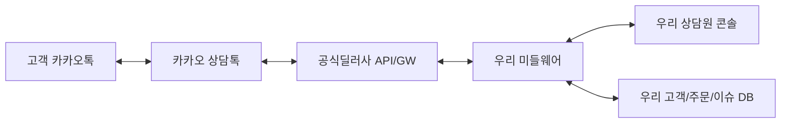

# 카카오 상담톡 딜러사 API-only 리서치

작성일: 2026-06-08
질문: 카카오 공식 상담톡 딜러사의 상담 사이트/솔루션을 쓰는 것이 아니라, 딜러사의 API/GW를 통해 우리 회사가 직접 상담톡 콘솔을 구현할 수 있는가?

## 결론

사용자 전제가 맞다. 카카오 공식 상담톡 문서는 상담톡을 "상담 메시지 API 상품"으로 설명하고, 메시지 발송 요청/발송 결과 확인 절차에 관한 기술규약정보(API)와 카카오 시스템 접근 권한으로 이루어진 상품이라고 설명한다. 또한 고객센터용 채팅상담 시스템 자체의 구축은 상담톡 서비스 제공 범위에 포함되지 않는다고 명시한다.

즉 우리가 만들려는 것은 다음 구조다.



딜러사 사이트에서 상담하는 것이 아니라, 딜러사의 상담톡 API/GW를 우리 서버가 호출하고 webhook을 받는 모델이다.

현재 공개 문서 기준으로 API-only 가능성이 가장 높은 후보는 다음이다.

1. 인포뱅크/Bizgo: 가장 직접적인 상담톡 API 문서와 샌드박스/통합 Key/ACL/SDK 문서가 있다. 1순위 후보.
2. 블룸에이아이/Happytalk: Biz API와 카카오 상담톡 웹훅 문서가 공개되어 있다. 인증키는 사용 목적 확인 및 조건 협의 후 제공된다. 2순위 후보.
3. 디케이테크인/Kakao i Connect Message: BizMessage API 호출 방식과 계약/스테이징/Swagger/IP 제한 문서가 있다. 다만 현재 공개 확인 문서는 알림톡/친구톡/SMS 등 비즈메시지 중심이고 상담톡 전용 수신/세션 API는 별도 확인 필요.

스펙트라, 한국클라우드, 더화이트커뮤니케이션, 트랜스코스모스코리아, 채널코퍼레이션은 상담 솔루션/컨택센터/API 연동 가능성은 보이지만, 공개적으로 바로 개발 가능한 상담톡 API 레퍼런스는 확인되지 않았다. 이들은 "API-only 계약 가능 여부"를 직접 문의해야 한다.

## 카카오 공식 문서에서 확인한 전제

공식 문서의 핵심:

- 상담톡은 고객이 카카오톡 채널에서 상담요청을 하면 시작되는 상담 메시지 API 상품이다.
- 상담원이 고객에게 먼저 말을 걸 수는 없다. 상담 세션은 고객이 먼저 말하면서 시작된다.
- 상담톡은 기술규약정보(API)와 카카오 시스템 접근 권한으로 이루어진 상품이고, 상담 시스템 구축은 서비스 범위에 포함되지 않는다.
- 상담톡은 공식 딜러사를 통해 공급된다.
- 정식 사용 시 기존 카카오톡 채널 관리자 웹/앱의 1:1 채팅 메뉴는 비활성화되고 기존 채팅 이력/메모는 더 이상 조회할 수 없게 된다.
- 상담톡 API를 통해서는 상담톡을 통한 1:1 채팅 수발신 내역만 조회할 수 있다. 알림톡/친구톡/단체메시지/자동응답 API 대화가 모두 상담톡으로 들어오는 것은 아니다.
- 개인정보 취급업무 위수탁 계약과 카카오 재위탁 승인 절차가 필요하다.

## 공식 딜러사 목록

2026-06-08 확인 기준 카카오 공식 상담톡 문서의 딜러사 목록:

| 딜러사 | 연락처 | 공개 API-only 판단 |
| --- | --- | --- |
| 스펙트라 | 02-508-7799 / info@spectra.co.kr | 공개 API 레퍼런스 미확인. DWorks 상담솔루션 중심으로 보임. 문의 필요. |
| 블룸에이아이 | 1666-5263 / help@blumn.ai | Happytalk Developer Center의 Biz API 및 카카오 상담톡 웹훅 문서 확인. API-only 후보. |
| 트랜스코스모스코리아 | 02-790-8106 / webmaster_tck@trans-cosmos.co.kr | 컨택센터/운영/BPO/솔루션 성격. 공개 API 레퍼런스 미확인. 문의 필요. |
| 인포뱅크 | 1588-2460 / talk@infobank.net | Bizgo Developers 상담톡 API 확인. API-only 1순위 후보. |
| 한국클라우드 | 070-5001-2290 / chl7107@hkcloud.co.kr | Tele-Talk 솔루션과 고객사 시스템 연계 설명 확인. 공개 API 레퍼런스 미확인. 문의 필요. |
| 채널코퍼레이션 | 02-1644-4052 / feedback@channel.io | 채널톡 솔루션형. 이번 범위에서는 제외. |
| 디케이테크인 | 1555-0055 / contact.dkt@kakaocorp.com | BizMessage API 호출 방식 문서 확인. 상담톡 전용 API 범위는 문의 필요. |
| 더화이트커뮤니케이션 | 02-468-1112 / help@thewc.co.kr | CloudGate 솔루션형. API/SDK 운영 흔적은 있으나 공개 상담톡 API 레퍼런스 미확인. 문의 필요. |

## 인포뱅크/Bizgo 조사

판단: 가장 직접적인 API-only 후보.

확인된 개발자 경험:

- 비즈고 Developers 사이트가 별도로 있다.
- 통합 Key를 발급받아 API를 사용한다.
- 최초 신규 가입 후 비즈니스 인증 완료 시 통합 Key가 자동 발급될 수 있다고 안내한다.
- 통합 Key에 허용 가능 IP(ACL)를 설정하고 상품을 연결해 활성화한다.
- 운영 Base URI와 Sandbox Base URI가 구분되어 있다.
- 인증 헤더는 `Authorization: ApiKey {발급받은 API 키}` 형태다.
- 발송 리포트 수신 방식은 사용 안 함, POLLING, WEBHOOK 중 선택 가능하다.
- Java, JavaScript, Python, Go, PHP SDK를 제공한다고 안내한다.

확인된 상담톡 API 엔드포인트:

| 기능 | Method/Path |
| --- | --- |
| Plain 메시지 발송 | `POST /api/comm/v1/cstalk/plain` |
| Rich 메시지 발송 | `POST /api/comm/v1/cstalk/rich` |
| 상담 종료 | `POST /api/comm/v1/cstalk/end` |
| 상담 종료 및 봇 전환 | `POST /api/comm/v1/cstalk/endWithBot` |
| 사용자 차단 | `POST /api/comm/v1/center/cstalk/profile/user/block` |
| 사용자 차단 해제 | `POST /api/comm/v1/center/cstalk/profile/user/unblock` |
| 세션 조회 | `GET /api/comm/v1/center/cstalk/session` |
| 이미지 업로드 | `POST /api/comm/v1/file/cstalk/image` |
| 파일 업로드 | `POST /api/comm/v1/file/cstalk` |
| 상담톡 이용 활성화 | `POST /api/comm/v1/center/cstalk/sender/activate` |
| 상담톡 이용 비활성화 | `POST /api/comm/v1/center/cstalk/sender/deactivate` |
| 채팅 활성화 | `POST /api/comm/v1/center/cstalk/sender/chat/activate` |
| 채팅 비활성화 | `POST /api/comm/v1/center/cstalk/sender/chat/deactivate` |
| 상담시간 조회 | `GET /api/comm/v1/center/cstalk/consult/time` |
| 상담시간 저장 | `POST /api/comm/v1/center/cstalk/consult/time` |
| 시스템 메시지 조회 | `GET /api/comm/v1/center/cstalk/system/message` |
| 시스템 메시지 저장 | `POST /api/comm/v1/center/cstalk/system/message` |
| 시스템 메시지 삭제 | `DELETE /api/comm/v1/center/cstalk/system/message/senderKey/{senderKey}/id/{id}` |
| 시스템 메시지 승인 요청 | `POST /api/comm/v1/center/cstalk/system/message/approval/request` |
| 시스템 메시지 승인 취소 | `POST /api/comm/v1/center/cstalk/system/message/approval/cancel` |

확인된 핵심 필드/정책:

- Plain 발송은 `userKey`, `senderKey`, `msgType`, `message` 등을 사용한다.
- `msgType`에 따라 TEXT, IMAGE, VIDEO, AUDIO, FILE을 발송할 수 있다.
- 요청의 참조값 `ref`는 발송 결과 Webhook에서 함께 반환될 수 있다.
- 응답에는 `msgKey`, `ref`가 포함된다.
- 상담 세션은 상담원이 메시지를 보내기 위한 필수 조건이다.
- 세션은 카카오톡 사용자의 마지막 메시지 수신 후 30일간 유지되고, 고객 메시지가 들어올 때마다 연장된다.
- `userKey`는 카카오톡 채널별 사용자 식별 키다. 같은 사용자라도 채널이 다르면 다른 키가 사용된다.
- 사용자가 탈퇴 후 재가입하면 `userKey`가 바뀔 수 있다.
- 사용자 메시지 수신 Webhook은 고객 Webhook URL로 사용자가 보낸 메시지 데이터를 전달하는 구조다.

Bizgo로 직접 구현할 수 있는 범위:

- 고객 메시지 webhook 수신
- 상담원 답장 발송
- Plain/Rich/파일 메시지 처리
- 세션 조회 및 종료
- 사용자 차단/해제
- 상담 가능 시간/시스템 메시지 관리
- 발송 결과 추적
- 우리 DB와 상담 콘솔 구현

남는 확인 질문:

- 월 API/GW 이용료, 최소 사용료, 상담톡 단가
- 운영키 발급 조건과 심사 기간
- webhook 도메인/IP 제한 조건
- rate limit
- 장애 SLA
- 상담톡 API-only 사용 시 비즈고 콘솔 사용이 필수인지 여부

## 블룸에이아이/Happytalk 조사

판단: API-only 또는 우리 시스템 연동 가능성이 있다. 다만 인증키는 조건 협의 후 제공된다.

Happytalk Biz API:

- 자체 구축 챗봇을 가진 업체가 채팅 상담을 사용하기 위한 API라고 설명한다.
- 방 생성, 메시지 발신, 상담 종료, 메시지 수신 기능이 있다.
- 개발 HOST는 `https://patch-biz-api.happytalk.io`, 운영 HOST는 `https://biz-api.happytalk.io`.
- 인증키는 사용 목적 확인 및 조건 협의 후 제공된다.

확인된 Biz API 엔드포인트:

| 기능 | 개발/운영 Path |
| --- | --- |
| 상담방 생성 | `POST /v1/chat/open` |
| 메시지 발신 | `POST /v1/chat/write` |
| 상담 종료 | `POST /v1/chat/end` |
| 메시지 수신 | 고객 수신도메인 `/message/{UUID}` |

확인된 주요 필드:

- 인증 헤더: `HT-Client-Id`, `HT-Client-Secret`
- 상담방 생성: `uuid`, `site_uid`, `category_id`, `division_id`, `title`, `order_number`, `product_number`, `parcel_number`, `parameter1~10`, `is_room_create_force`
- 메시지 발신: `uuid`, `room_id`, `type`, `msg`, `url`
- 상담 종료: `uuid`, `room_id`, `end_type`

Happytalk 카카오 상담톡 웹훅 문서:

- 해피톡을 통해 카카오 상담톡을 연동하고 상담 기능을 구현할 수 있도록 제공되는 API라고 설명한다.
- 개발 HOST는 `https://patch-kakao-api.happytalk.io`, 운영 HOST는 `https://kakao-api.happytalk.io`.
- 인증키는 사용 목적 확인 및 조건 협의 후 제공된다.

문서상 API 목록:

- 발신프로필 조회
- 채팅 활성화/비활성화
- 상담시간 조회/저장
- 시스템 메시지 조회
- POST/GET 방식 상담 연결
- 챗봇 대화 내역 조회
- 수신 도메인 조회/저장
- 사용자 메시지 수신
- 사용자 메타 정보 수신
- 세션 종료 정보 수신
- Plain/Rich 메시지 발송
- 일반 상담 종료
- 종료 후 봇 이벤트 실행
- 사용자 차단/해제
- 이미지/기타 파일/비즈니스폼 업로드

주의:

- Happytalk은 자체 상담 솔루션도 강하게 제공한다.
- API-only 계약이 가능한지, 해피톡 콘솔 사용이 필수인지 확인해야 한다.
- 문서에 "사용 목적 확인 및 조건 협의 후 제공"이라고 되어 있어, 완전 셀프서비스는 아니다.

## 디케이테크인 조사

판단: API 호출 방식은 가능해 보이나, 상담톡 전용 자체 콘솔 구현 범위는 추가 확인 필요.

확인된 것:

- Kakao i Connect Message의 BizMessage 서비스는 Agent 설치 방식 또는 API 호출 방식 중 하나를 선택할 수 있다.
- BizMessage API는 등록된 고객에 한해 허용된 IP로만 접근 가능한 제한적 서비스다.
- 별도 서비스 계약이 필요하다.
- Swagger UI가 있고, 담당자에게 방화벽 오픈을 요청해야 한다.
- 운영/스테이징 서버가 구분된다.
- 스테이징 서버도 실제 메시지가 발송될 수 있으므로 오발송 주의가 필요하다.

주의:

- 공개 문서는 알림톡/친구톡/SMS/RCS/네이버톡톡 중심이다.
- 상담톡 전용 사용자 메시지 수신, 세션 종료, 상담원 답장, 상담시간/시스템 메시지 관리 API까지 제공되는지는 공개 문서만으로 확정되지 않았다.
- 디케이테크인은 카카오 계열사 성격이 있어 안정성은 기대되지만, API-only 계약 조건은 직접 문의해야 한다.

## 다른 딜러사

### 스펙트라

스펙트라 블로그는 "카카오 상담톡 API + 상담솔루션" 구조를 설명하고, 실제 상담은 DWorks에서 처리된다고 설명한다. 즉 API 연동 구조 자체는 맞지만, 공개 개발자 레퍼런스는 확인되지 않았다.

판단:

- 솔루션형/DWorks 중심.
- 우리 자체 콘솔 구현을 위한 API-only 계약은 문의 필요.

### 한국클라우드

Tele-Talk 솔루션은 카카오톡 등 다양한 채팅 채널 및 고객사 기간계 시스템과 연계 가능하다고 설명한다. 하지만 공개 상담톡 API 문서는 확인되지 않았다.

판단:

- 컨택센터 솔루션형.
- 기간계 연동은 가능해 보이나 API-only는 문의 필요.

### 더화이트커뮤니케이션

CloudGate는 전화/채팅/챗봇/이메일 등 통합 고객상담 솔루션 성격이다. API 연동 가능성은 보이지만 공개 상담톡 API 레퍼런스는 확인되지 않았다.

판단:

- 솔루션/BPO/컨택센터형.
- 자체 콘솔을 만들기 위한 상담톡 API-only 계약 가능 여부는 문의 필요.

### 트랜스코스모스코리아

컨택센터/BPO/IT 솔루션 성격이 강하다. 공개 상담톡 API 레퍼런스는 확인되지 않았다.

판단:

- 운영대행/컨택센터형.
- API-only 후보로는 우선순위 낮음.

### 채널코퍼레이션

채널톡 솔루션형이다. 사용자가 채널톡을 배제하기로 했으므로 이번 범위에서는 제외한다.

## 직접 구현 가능 범위

딜러사 API/GW 계약을 받을 수 있으면 아래는 직접 구현 가능하다.

- 상담톡 버튼 또는 카카오 채널 진입점 구성
- 고객 메시지 webhook 수신
- `userKey`/`uuid` 기준 고객 식별
- 상담방 생성/상태 관리
- 상담방 목록/타임라인 UI
- 상담원 답장 발송
- Plain/Rich/파일 메시지 지원
- 상담 종료/세션 종료 처리
- 발송 결과 webhook 또는 polling 처리
- 상담시간/시스템 메시지 관리
- 내부 메모/담당자/태그/검색
- 기존 주문/이슈 DB 조회 패널
- 모든 원문 payload/audit log 저장

1차 MVP에서 빼야 할 것:

- 전화
- STT
- AI 응답
- 자동 배정 고도화
- 복잡한 통계
- 멀티테넌시
- 외부 고객에게 파는 SaaS화

## 계약 문의 문구

```
저희는 딜러사 상담 콘솔을 사용하는 것이 아니라,
귀사의 카카오 상담톡 API/GW를 통해 사내 상담 콘솔을 직접 개발하려고 합니다.

요구사항:
- 상담원 약 6명
- 카카오 상담톡 수신/발신
- 고객 메시지 webhook 수신
- 상담원 답장 API 발송
- Plain/Rich/이미지/파일 메시지
- 상담 세션 조회/종료
- 발송 결과 수신
- 상담시간/시스템 메시지 관리
- 사용자 차단/해제
- 기존 고객/주문/이슈 DB와 자체 연동
- 전화, STT, AI 응답은 1차 범위에서 제외

확인 부탁드립니다.

1. 귀사의 상담톡 API/GW만 사용하는 API-only 계약이 가능한가요?
2. 딜러사 상담 콘솔 사용 없이 자체 상담 콘솔만 운영해도 되나요?
3. 개발/샌드박스 환경과 운영 API Key를 제공하나요?
4. 운영 webhook URL을 저희 도메인으로 등록할 수 있나요?
5. API/GW 월비, 초기비, 최소 사용료, 상담톡 단가는 얼마인가요?
6. rate limit, 허용 IP, 장애 SLA, 기술지원 범위는 어떻게 되나요?
7. 카카오 채널/발신프로필/상담톡 활성화 절차와 소요 기간은 어떻게 되나요?
8. 기존 카카오톡 채널의 1:1 채팅 비활성화와 기존 상담 이력 유실 이슈를 어떻게 처리해야 하나요?
9. 계약 종료 또는 딜러사 변경 시 userKey/상담이력/설정 이전이 가능한가요?
10. 개인정보 위수탁/재위탁 계약 템플릿을 제공하나요?
```

## 우선순위

1. 인포뱅크/Bizgo에 먼저 문의한다. 이유: API 레퍼런스, 샌드박스, 통합 Key, ACL, SDK가 가장 직접적이다.
2. 블룸에이아이/Happytalk에 동시에 문의한다. 이유: 카카오 상담톡 웹훅 API 목록이 넓고, 자체 구축 연동용 Biz API가 있다.
3. 디케이테크인에 상담톡 전용 API 범위를 확인한다. 이유: API 호출 방식 문서는 있으나 상담톡 전용 공개 범위가 불명확하다.
4. 스펙트라/한국클라우드/TWC는 솔루션형으로 보되, API-only 가능 여부를 확인한다.

## 비용 관점

API-only 계약이 가능하면 딜러사 외주비는 필수가 아니다. 남는 비용은 다음이다.

- 상담톡 사용료: 대화방당 80~100원 수준 추정.
- API/GW 월비: 0~150만원/월 추정.
- 초기 세팅비: 0~500만원 추정.
- 우리 서버/DB/운영 비용.
- 사용자 직접 개발 시간.

### 비용 항목 상세 breakdown

아래는 "내부 개발비 0원, 외주 없음, 딜러사 상담 콘솔 사용 안 함"을 전제로 한 비용 항목이다.

| 항목 | 필수 여부 | 산정 기준 | 내야 하는 경우 | 안 내도 되는 경우 |
| --- | --- | --- | --- | --- |
| 상담톡 사용료 | 사실상 필수 | 24시간 활성 상담방 수 x 단가 | 실제 고객 상담이 발생하는 경우 | 테스트/Sandbox 또는 상담 발생 없음 |
| API/GW 월비 | 딜러사별 | API Key/Gateway/운영 접근권 월 사용료 | 딜러사가 API 사용권/최소 사용료를 별도 청구하는 경우 | API 사용료 없이 건별 과금만 받는 계약 |
| 초기 세팅비 | 딜러사별/협상 | 계약/개통/발신프로필/상담톡 활성화/webhook 등록 지원의 1회 비용 | 딜러사가 개통 작업을 수동 처리하거나 기술 온보딩을 제공하는 경우 | 회원가입/비즈니스 인증/API Key/상품 연결이 셀프서비스이고 별도 지원을 안 받는 경우 |
| 샌드박스 비용 | 보통 불필요 | 테스트 환경 사용료 | 딜러사가 유료 PoC/기술지원으로 묶는 경우 | Bizgo처럼 Sandbox를 비용 부담 없이 테스트할 수 있다고 안내되는 경우 |
| SLA/기술지원비 | 선택/협상 | 장애 응답시간, 전담지원, 운영 문의 | 장애 대응 SLA나 전담 엔지니어를 원하는 경우 | 베스트에포트/일반 고객센터 지원으로 충분한 경우 |
| 서버/DB/로그/백업 | 우리 비용 | 신규 인프라 증분 비용 | 신규 서버/DB/로그 저장소를 띄우는 경우 | 기존 사내 인프라에 얹고 증분 비용을 0으로 보는 경우 |
| 보안/개인정보 자문 | 선택 | 위수탁계약/개인정보처리방침/로그 보존 검토 | 법무/보안 검토를 외부에 맡기는 경우 | 내부에서 처리하는 경우 |

### 초기 세팅비란 무엇인가?

초기 세팅비는 카카오나 딜러사가 공식적으로 항상 받는 고정 비용이라고 단정하면 안 된다. 견적에서 나올 수 있는 1회성 비용 후보를 임시로 부른 이름이다.

초기 세팅비로 묶일 수 있는 작업:

- 계약/사업자 확인/비즈니스 인증 안내
- 카카오톡 채널과 상담톡 상품 연결
- 발신프로필 또는 senderKey 연결
- 상담톡 활성화/채팅 활성화
- API Key 발급 또는 운영 권한 오픈
- 운영 webhook URL 등록
- 허용 IP 또는 방화벽/ACL 등록
- Sandbox에서 운영 환경으로 전환
- 발송 결과 리포트 webhook/polling 설정
- 개인정보 위수탁/재위탁 문서 안내
- 딜러사 엔지니어의 기술 온보딩 미팅

이 작업을 모두 고객사가 셀프서비스로 처리하고 딜러사가 별도 작업을 하지 않으면 초기 세팅비는 0원이어야 한다. 반대로 딜러사가 담당자를 붙여 개통/테스트/운영 전환을 도와주면 1회 비용을 요구할 수 있다.

### "다 필요없다"면 내야 하는가?

원칙적으로는 아니다. 아래 항목을 모두 거절하면 초기 세팅비와 구축비는 없어야 한다.

- 딜러사 상담 콘솔 사용 안 함
- 커스텀 개발 의뢰 안 함
- 데이터 이전/migration 안 함
- 전담 온보딩 안 함
- SLA/전담지원 안 함
- 외부 보안 자문 안 함
- 별도 리포트/대시보드 개발 안 함

그래도 남을 수 있는 비용은 딱 세 가지다.

1. 상담톡 사용료: 실제 상담이 발생하면 발생.
2. API/GW 월비 또는 최소 사용료: 딜러사 계약 정책상 있을 수 있음.
3. 우리 인프라 증분 비용: 기존 인프라를 쓰면 0원으로 볼 수 있음.

따라서 견적 요청 시 "초기 구축비/세팅비 없이 API-only로 가능한지"를 명시해야 한다. 견적서에 초기비가 있으면 항목별로 무엇을 해주는 비용인지 쪼개서 달라고 요구해야 한다.

여기서 회사 내부 개발비를 완전히 0원으로 잡으면 추정은 더 낮아진다. 즉 외주비도 없고, 내부 개발자 인건비/기회비용도 예산에 반영하지 않는 계산이다.

| 항목 | 낮은 추정 | 현실적 추정 | 비고 |
| --- | ---: | ---: | --- |
| 딜러사 초기 세팅비 | 0~100만원 | 100만~500만원 | API-only 계약 조건에 따라 0원 가능 |
| API/GW 월비 | 0~30만원/월 | 30만~150만원/월 | 최소 사용료/SLA 포함 여부 확인 |
| 상담톡 실비 | 8만~30만원/월 | 30만~100만원/월 | 월 활성 상담방 수에 따라 변동 |
| 서버/DB/로그/백업 | 20만~80만원/월 | 80만~200만원/월 | 기존 인프라를 쓰면 더 낮아질 수 있음 |
| 보안/개인정보 자문 | 0원 | 100만~500만원/년 | 필요 시만 |

첫해 현금 지출 재추정:

- 아주 낮은선: 200만~800만원/년. API/GW 월비와 초기비가 0원에 가깝고, 기존 인프라를 재사용하며, 월 상담방이 1,000~3,000건 수준인 경우.
- 낮은 운영선: 500만~1,500만원/년. API/GW 월비가 낮거나 없고 기존 인프라를 대부분 재사용하는 경우.
- 현실적 운영선: 1,500만~3,500만원/년. API/GW 월비와 서버/로그/백업을 정상적으로 잡는 경우.
- 보수적 운영선: 3,500만~5,000만원/년. 딜러사 월비/SLA/보안/모니터링이 붙는 경우.

따라서 이전에 말한 "1,500만~3,000만원 낮은선, 3,000만~6,000만원 현실선"은 내부 개발비를 현금으로 크게 넣은 수치라기보다, 운영 안정화 버퍼를 보수적으로 본 수치다. 내부 개발비를 0으로 강하게 놓고 딜러사 API/GW 비용도 낮으면 첫해 현금 지출은 200만~1,500만원까지 내려갈 수 있다. 현실 운영선은 1,500만~3,500만원이다. 단, 직접 개발자가 2~5개월 핵심 시간을 투입해야 한다는 사실은 변하지 않는다.

## 채널톡과 비용 차이가 별로 없는가?

운영형으로 제대로 계산하면 맞다. 직접구현과 채널톡의 연간 비용이 겹치는 구간이 생긴다.

| 선택지 | 첫해 현금 비용 | 포함되는 것 | 빠지는 것 |
| --- | ---: | --- | --- |
| 직접구현 최저선 | 200만~800만원 | 상담톡 실비, 최소 API/GW, 기존 인프라 | 안정적 운영도구, SLA, 완성 UI, 권한/통계/검색 고도화 |
| 직접구현 현실선 | 1,500만~3,500만원 | API/GW, 서버/로그/백업, 기본 운영 안정화 | 내부 개발자 시간, 장애 책임은 우리 부담 |
| 직접구현 보수선 | 3,500만~5,000만원 | SLA/보안/모니터링 일부 포함 | 여전히 제품 책임은 우리 부담 |
| 채널톡 엔터프라이즈 추정 | 1,800만~3,500만원+ | 완성 상담 UI, 운영도구, 전화/다채널 확장, 지원 | 데이터/흐름 통제권 제한, 엔터프라이즈 견적 의존 |

따라서 비용만 보면 두 결론이 동시에 맞다.

1. 최저 현금비용만 보면 직접구현이 더 싸다.
2. 운영 품질까지 넣으면 채널톡과 큰 차이가 안 날 수 있다.

직접구현이 의미 있는 경우:

- 대표가 채널톡 같은 SaaS 도입을 허용하지 않는다.
- 상담 데이터를 우리 DB와 업무 흐름 안에 완전히 넣고 싶다.
- 주문/계약/이슈 화면과 상담 UI를 깊게 붙여야 한다.
- 상담 콘솔을 회사 내부 AX 도구 또는 장기 제품으로 키울 생각이 있다.
- 당장 완성도보다 통제권과 학습/내재화가 더 중요하다.

채널톡이 나은 경우:

- 목표가 Zendesk/MatrixCloud 해지 후 빠른 안정 운영이다.
- 상담원 6명이 당장 매일 써야 한다.
- 전화, 권한, 통계, 검색, 보안, 운영 편의성이 중요하다.
- 개발자가 2~5개월 묶이면 더 큰 손실이다.
- 상담 시스템 자체가 회사의 핵심 제품이 아니다.

정리하면, "비용 절감"만 목표라면 직접구현은 애매하다. 정말 낮은 비용으로 가려면 기능을 많이 포기하고 직접 운영 리스크를 떠안아야 한다. 반대로 운영 안정성까지 맞추면 채널톡 엔터프라이즈와 비용 차이가 줄어든다. 직접구현의 명분은 비용보다 데이터 통제권, 내부 시스템 밀착, SaaS 도입 거부 상황 대응이다.

## 참고 소스

- Kakao Business 상담톡 공식 가이드: https://kakaobusiness.gitbook.io/main/ad/cstalk
- Bizgo Developers: https://developers.bizgo.io/
- Bizgo 연동관리: https://developers.bizgo.io/guide/setup
- Bizgo 상담톡 API: https://developers.bizgo.io/api-sdk/api-reference/comm/kakao-counsel
- Bizgo 카카오 비즈메시지 가이드: https://developers.bizgo.io/guide/message/kakao
- Happytalk Biz API: https://developer-center.happytalk.io/Biz-API/
- Happytalk 메시지 발신: https://developer-center.happytalk.io/Biz-API/counsel/send_message/
- Happytalk 메시지 수신: https://developer-center.happytalk.io/Biz-API/counsel/Receive/message
- Happytalk 카카오 상담톡 웹훅: https://developer-center.happytalk.io/KakaoWebhook/
- DKTechin BizMessage API 호출 방식: https://docs.kakaoi.ai/kakao_i_connect_message/bizmessage/api/
- DKTechin BizMessage 이용 절차: https://docs.kakaoi.ai/kakao_i_connect_message/bizmessage/
- 스펙트라 상담톡 구조 블로그: https://www.spectra.co.kr/blog/kakao-consultation-process
- 한국클라우드 Tele-Talk: https://www.hkcloud.co.kr/business-area/tele-talk
- TWC CloudGate 상담솔루션: https://thewc.co.kr/cloudgate/consultationsolution/
