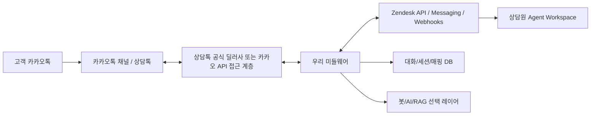
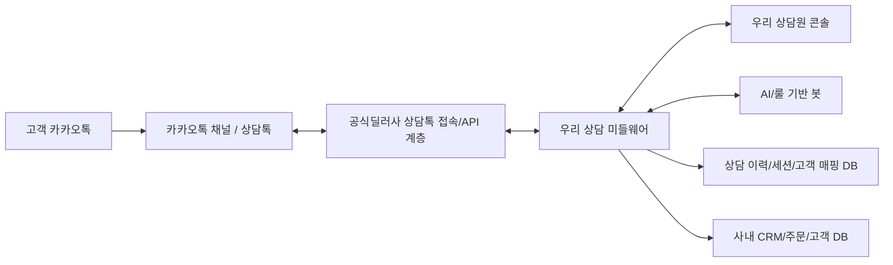

# 카카오 상담톡 + Zendesk/MatrixChat 직접 구현 리서치

작성일: 2026-06-08
질문: Zendesk에서 MatrixChat/MatrixCloud처럼 기업 카카오톡 상담을 받고, Zendesk에서 상담원이 메시지를 답장하고, 필요하면 고객에게 메시지를 발송하는 시스템을 직접 만들 수 있는가?

## 결론

직접 개발은 가능하지만, "그냥 Kakao Developers 앱을 만들고 API를 호출"하는 방식은 아니다. 상담톡은 카카오 비즈메시지의 CS Talk 상품이고, 공개 디벨로퍼스 API만으로 바로 붙는 일반 메시지 API가 아니다. 카카오 공식 가이드는 상담톡을 공식 딜러사를 통해 공급한다고 설명한다.

현실적인 선택지는 3가지다.

1. 현재처럼 MatrixCloud/MatrixChat 같은 공급사를 계속 쓰고, 필요한 자동화만 Zendesk API/웹훅으로 보강한다.
2. 카카오 상담톡 API 접근은 공식 딜러사 계약을 통해 유지하되, 우리 쪽 미들웨어와 Zendesk 연동부는 직접 만든다. 가장 현실적인 직접개발 경로다.
3. 대행사/딜러 없이 완전 직접 운영하려면 카카오 상담톡 공식 딜러사/파트너에 준하는 계약 또는 접근 권한을 확보해야 할 가능성이 높다. 공개 자료 기준으로는 일반 고객사가 상담톡 API를 셀프 발급받아 운영하는 흐름이 보이지 않는다.

난이도는 "API 접근권만 있으면 중상", "대행사 없이 카카오와 직접 붙으려면 매우 높음"이다. 기술보다 계약/권한/운영정책/개인정보 처리가 더 큰 장벽이다.

## 용어 정리

### 카카오톡 채널

기업의 카카오톡 내 비즈니스 홈이다. 채널 자체는 무료로 만들 수 있고, 채팅/메시지/소식/쿠폰/챗봇 연결 등을 제공한다. 채널은 비즈니스 채널 심사를 거쳐야 신뢰 표시와 비즈메시지 연동에 필요한 기반이 된다.

### 상담톡(CS Talk)

고객이 카카오톡 채널이나 상담하기 버튼에서 먼저 상담을 시작하면, 기업 상담원이 상담 시스템에서 응답할 수 있게 해주는 채팅 상담 API 상품이다. 카카오 가이드는 상담톡을 "상담 메시지 API 상품"으로 설명하며, 고객센터용 상담 화면 자체는 상담톡 제공 범위가 아니라고 명시한다. 즉 카카오는 메시지/API/접근권을 주고, 상담 UI/라우팅/이력/상담원 도구는 별도 솔루션이 만든다.

중요 제약:

- 상담원이 먼저 아무 고객에게나 상담톡을 시작할 수 없다. 사용자가 상담을 먼저 시작해야 한다.
- 상담 세션이 끝나면 사용자가 다시 먼저 말하기 전까지 상담원이 말을 걸 수 없다.
- 상담톡에서는 `user_key` 같은 식별값으로 동일 사용자를 구분할 수 있지만, 프로필명/프로필 이미지를 확인할 수 없다고 안내되어 있다.
- 상담톡으로 조회 가능한 범위는 상담톡 API를 통한 1:1 채팅 수발신 내역이다. 알림톡/친구톡/단체 메시지/자동응답 챗봇 대화가 상담톡에 그대로 들어오는 구조가 아니다.
- 상담톡 정식 사용 시 기존 카카오톡 채널 관리자 웹/앱의 채팅 메뉴가 비활성화될 수 있다.

### 알림톡 / 친구톡 / 채널 메시지

상담톡과 목적이 다르다.

- 알림톡: 주문, 예약, 결제, 배송 등 정보성 메시지. 사전 승인된 템플릿과 심사 정책이 핵심이다.
- 친구톡/채널 메시지: 채널 친구나 마케팅 수신 동의 대상에게 보내는 홍보/마케팅 메시지 성격이 강하다.
- 상담톡: 고객이 먼저 연 상담 세션 안에서 상담원이 대화하는 기능이다.

따라서 "고객에게 먼저 메시지를 발송"하려면 보통 상담톡이 아니라 알림톡/친구톡/채널 메시지 또는 카카오모먼트 개인화 메시지 영역을 봐야 한다.

### Kakao Developers 카카오톡 메시지 API

혼동하면 안 된다. Kakao Developers의 Kakao Talk Message API는 같은 서비스 사용자 간 상호작용/공유 목적의 사용자-사용자 메시지에 가깝다. 공식 문서도 서비스가 사용자에게 직접 메시지를 보내는 용도는 Brand Message, Info Talk, CS Talk 등 Kakao Business 상품을 선택하라고 구분한다. 즉 기업 고객센터 발신/상담 용도로는 Kakao Developers 메시지 API만으로 해결되지 않는다.

## MatrixCloud/MatrixChat이 하는 일로 보이는 것

공개 MatrixCloud 도움말 기준으로 MatrixChat의 카카오 상담톡 연동은 다음 전제를 요구한다.

- 카카오톡 비즈니스 채널이 필요하다.
- 운영 채널은 비즈니스 인증이 필요하다.
- 데모 구성 시 개발자 채널을 만들 수 있다.
- 채널 관리자센터에서 채널 정보 또는 관리자 권한을 MatrixCloud 측에 제공한다.
- 1:1 채팅 옵션과 채널 공개 상태를 켜야 한다.

즉 MatrixCloud는 카카오 상담톡 접근/전환을 받아서 Zendesk 상담 환경에 붙여주는 중간 솔루션 역할로 보인다. 업데이트 공지에는 상담 종료 확인, 고객/상담원 종료 구분, 이전 상담 이력 조회 같은 상담 솔루션 기능도 보인다. 과금 안내에는 상담톡이 메시지 수가 아니라 상담 세션/채팅방 단위로 과금된다는 설명도 있다.

## Zendesk 쪽 구현 선택지

### 1. Zendesk 티켓 API 기반

가장 단순한 방식이다.

- 카카오 상담톡 inbound 메시지 -> 우리 미들웨어 -> Zendesk 티켓 생성/댓글 추가
- Zendesk 상담원 public reply/comment -> Zendesk webhook/trigger -> 우리 미들웨어 -> 카카오 상담톡 send API 호출

장점:

- 구현이 상대적으로 단순하다.
- 기존 Zendesk Support 티켓 업무흐름, 트리거, 태그, SLA, 매크로를 활용하기 쉽다.

주의:

- 진짜 "메신저 대화"처럼 보이게 하려면 댓글/상태/세션 매핑을 잘 설계해야 한다.
- Zendesk 댓글을 카카오로 보낼 때 중복 발송, 내부 메모 오발송, 자동 트리거 메시지 오발송 방지가 중요하다.
- 상담 세션이 닫힌 뒤에는 상담톡으로 발송하면 실패하거나 정책 위반이 될 수 있으므로 세션 상태를 엄격히 추적해야 한다.

### 2. Zendesk Messaging / Sunshine Conversations 기반

Zendesk Messaging은 Sunshine Conversations 기반 대화 모델을 제공하고, 웹훅으로 대화 메시지를 받을 수 있으며 API로 메시지를 보낼 수 있다. 공식 문서는 대화 CRUD, 메시지 발송, 실시간 웹훅, switchboard 기반 봇/상담원 오케스트레이션을 지원한다고 설명한다.

가능한 모양:

- 카카오 상담톡 메시지를 외부 채널처럼 Sunshine Conversations conversation/user로 매핑
- Zendesk Agent Workspace에서 상담원이 대화
- 우리 미들웨어가 카카오와 Sunshine/Zendesk 사이를 브리지

장점:

- Zendesk Agent Workspace의 메시징 UX에 더 가깝다.
- 봇, 상담원 핸드오프, conversation history 모델을 잘 활용할 수 있다.

주의:

- Zendesk 기본 소셜 메시징 채널 목록에는 WhatsApp, LINE, WeChat, Facebook Messenger, X DM, Instagram DM, Apple Messages 등이 보이고, KakaoTalk은 공개 기본 채널로 확인되지 않는다.
- Sunshine Conversations 추가/커스텀 연동 권한은 Zendesk 플랜 또는 별도 라이선스 조건을 확인해야 한다.
- 카카오 상담톡 채널이 Sunshine 공식 채널로 제공되는 것이 아니라면, 결국 우리 미들웨어가 커스텀 채널 역할을 해야 한다.

### 3. Zendesk 앱 + 외부 상담 콘솔

Zendesk 안에 사이드바/탑바 앱을 만들고, 실제 카카오 상담 UI는 우리 서버가 담당하는 방식이다.

장점:

- 카카오 상담톡 특유의 세션/종료/과금/미디어 정책을 직접 반영하기 쉽다.
- 기존 MatrixChat과 비슷한 체감 UI를 만들 수 있다.

주의:

- Zendesk 기본 대화 흐름과 별도 UI가 생겨 운영 교육/권한/감사가 복잡해진다.
- 상담 이력을 티켓 댓글로 동기화하지 않으면 Zendesk 리포팅에서 누락된다.

## 직접 구현 아키텍처 초안



미들웨어가 반드시 가져야 할 매핑:

- Kakao `user_key` -> Zendesk user/external_id
- Kakao 상담 세션/채팅방 -> Zendesk ticket 또는 Sunshine conversation
- Kakao message id -> Zendesk comment/message id
- Zendesk comment/message id -> Kakao send result
- 세션 상태: opened, assigned, bot_handled, agent_handoff, ended_by_customer, ended_by_agent, expired

필수 구현 포인트:

- inbound/outbound 메시지 idempotency
- 재시도 큐와 실패 보상
- 내부 메모와 외부 답장 분리
- 상담톡 세션 종료 이후 발송 차단
- 미디어 업로드/다운로드 프록시
- 개인정보 마스킹/보존기간/삭제 요청 처리
- 카카오 API 장애와 Zendesk 장애 분리 처리
- 상담원 권한, 라우팅, 동시 상담 수, 근무시간
- 감사 로그와 발송 원문 보관

## 받아야 할 권한과 확인할 계약

### 카카오/채널 쪽

- 카카오톡 채널 관리자 권한, 가능하면 마스터 또는 관리 권한
- 비즈니스 채널 인증 완료 여부
- 채널 공개 ON, 1:1 채팅 ON, 상담톡 전환 가능 상태
- 개발/운영 채널 분리 가능 여부
- 현재 상담톡 계약 주체: MatrixCloud인지, 다른 공식 딜러사인지, 카카오 직접 계약인지
- 상담톡 API 명세, 테스트 환경, 인증키, 웹훅 URL 등록 권한
- 한 채널이 동시에 여러 상담톡 솔루션/딜러에 연결될 수 있는지 여부
- 기존 MatrixChat 사용 중단/전환 시 채팅 이력, 차단 고객, 버튼, 과금 영향

### 메시지 발송 쪽

- 알림톡 발송 권한과 템플릿 심사/승인 프로세스
- 친구톡 또는 채널 메시지 발송 권한
- 마케팅 수신 동의/철회 데이터 관리 주체
- 광고성 정보 표기, 야간 발송 제한 등 법규 준수 프로세스
- 발송 실패 시 SMS 대체발송 여부와 비용

### Zendesk 쪽

- Zendesk admin 권한
- API token 또는 OAuth app 생성 권한
- Webhook/trigger 생성 권한
- Agent Workspace/Messaging 사용 상태
- Sunshine Conversations API key 및 Conversations integration 생성 가능 여부
- 필요한 플랜/라이선스: Suite Professional 이상 또는 별도 Sunshine Conversations 라이선스가 필요한지 계정에서 확인
- Marketplace app으로 배포할지, 내부 전용 앱으로 둘지

### 개인정보/보안 쪽

- 상담톡 공식 딜러사와 개인정보 처리 위수탁 계약
- 카카오 재위탁 승인/고지 구조
- 개인정보 처리방침의 수탁사/재위탁사 반영
- 상담 시작 안내 메시지에 상담내용 보관/처리 안내 포함
- 고객 개인정보 수집 시 별도 동의 문구
- 보존기간, 삭제 요청, 접근권한, 로그 감사
- 웹훅 서명 검증, IP allowlist, TLS, 비밀키 관리

## "대행사 없이 직접개발" 판단

### API 접근권이 이미 있거나 딜러사가 API-only 사용을 허용하는 경우

직접 개발 가능성이 높다. 다만 상담 UI와 Zendesk 연결, 세션 상태, 개인정보, 장애 대응까지 만들면 MVP도 작지 않다.

예상 난이도:

- PoC: 1-3주
- 사내 MVP: 4-8주
- 운영 품질: 2-4개월 이상

PoC 범위:

- 개발 채널 또는 테스트 채널
- 텍스트 메시지 inbound/outbound
- Zendesk 티켓 1개 생성/댓글 왕복
- `user_key` 기준 고객 식별
- 세션 종료 이벤트 또는 종료 명령 처리

운영 확장:

- 미디어/파일
- 상담 배정/동시 상담/근무시간
- 봇 응답/상담원 핸드오프
- 알림톡/친구톡 발송 통합
- 리포팅/CSAT
- 장애/재처리/감사로그

### 딜러사 없이 카카오에 직접 붙고 싶은 경우

공개 문서 기준으로는 쉽지 않다. 상담톡은 공식 딜러사를 통해 공급된다고 되어 있고, 일반 Kakao Developers 앱의 메시지 API와 목적/권한이 다르다. 완전 직접 운영하려면 카카오와 별도 계약 또는 공식 딜러사/파트너 지위가 필요할 가능성이 높다.

여기서 "파트너가 되어야 하나?"에 대한 답은: 상담톡 API를 원천적으로 직접 받으려면 거의 그렇다고 보는 게 안전하다. 다만 우리 회사가 자체 상담 시스템을 개발하더라도, 카카오 접속 계층은 공식 딜러사 계약을 통해 받을 수 있다면 파트너가 되지 않아도 된다.

## 지금 회사 상황에서 해야 할 다음 액션

1. 현재 MatrixChat 계약서/청구서에서 카카오 상담톡 계약 주체를 확인한다.
2. MatrixCloud 또는 현재 공급사에 "상담톡 API-only/미들웨어 직접연동이 가능한지", "채널 전환 없이 병행 테스트 가능한지", "개발 채널 제공이 가능한지"를 묻는다.
3. 카카오 채널 관리자센터에서 운영 채널의 비즈니스 인증, 홈 공개, 1:1 채팅, 관리자 권한 상태를 확인한다.
4. Zendesk Admin Center에서 Messaging/Sunshine Conversations API 사용 가능 여부와 플랜 제한을 확인한다.
5. 빠른 검증은 Zendesk 티켓 API 방식으로 한다. Agent Workspace 메시징까지 완전히 자연스럽게 붙이는 건 두 번째 단계로 미룬다.
6. 고객에게 먼저 보내는 메시지는 상담톡이 아니라 알림톡/친구톡/채널 메시지 범위로 별도 설계한다.

## 공급사에 보낼 질문 초안

```
안녕하세요.
현재 Zendesk + MatrixChat으로 카카오 상담톡을 사용 중인데,
사내 시스템과의 직접 연동 가능성을 검토하고 있습니다.

확인 부탁드립니다.

1. 현재 저희 카카오톡 채널의 상담톡 계약/접속 주체가 MatrixCloud인지, 다른 공식 딜러사인지 확인 가능할까요?
2. 상담톡 API를 저희 사내 미들웨어에서 직접 호출하거나 webhook을 받을 수 있는 API-only 연동 형태가 가능한가요?
3. 운영 채널과 별도로 개발/테스트 채널을 구성할 수 있나요?
4. 한 카카오톡 채널을 기존 MatrixChat과 신규 미들웨어가 병행해서 테스트할 수 있나요, 아니면 상담톡 연결은 단일 솔루션만 가능한가요?
5. 상담 세션 시작/종료, 메시지 수발신, 파일/이미지, user_key, 발송 결과, 실패 코드 관련 API 명세를 받을 수 있나요?
6. 상담톡 사용 중단 또는 솔루션 전환 시 기존 상담 이력, 차단 고객, 채널 관리자 채팅 메뉴, 상담하기 버튼, 과금에는 어떤 영향이 있나요?
7. 개인정보 처리 위수탁/재위탁 계약과 개인정보처리방침 반영 항목은 어떻게 안내받을 수 있나요?
```

## 2026-06-08 추가 확인: Zendesk 해지 전제와 공식딜러사/API 역할

추가 질문: Zendesk 계약을 해지할 예정이라면, 공식딜러사는 MatrixCloud 같은 자체 상담 솔루션을 만들 수 있도록 API를 열어주는 서비스인가?

### 확인 결론

공식딜러사는 "카카오 상담톡 API를 일반 개발자에게 셀프서비스로 열어주는 포털"이라기보다, 카카오와 계약된 상담톡 공급/연동/운영 파트너에 가깝다. 카카오 공식 상담톡 가이드는 공식딜러사의 역할을 "상담톡을 활용한 채팅 상담 솔루션 또는 컨택센터 운영 서비스를 개발하여 상담톡을 쉽고 빠르게 쓸 수 있도록 돕는 역할"이라고 설명한다. 즉 MatrixCloud류의 솔루션을 딜러사가 직접 만들거나, 고객사/엔터프라이즈에 연동 서비스를 제공하는 주체다.

다만 실제 시장에서는 일부 공식딜러사/상담 플랫폼이 고객사 자체 시스템과 붙을 수 있는 API를 제공한다. 예를 들어 인포뱅크 Bizgo Developers는 문자, 카카오 비즈메시지, RCS를 하나의 API로 통합 발송하고, SDK/샌드박스/개발자 계정을 제공한다고 안내한다. 블룸에이아이/해피톡 Developer Center는 자체 챗봇을 가진 업체가 채팅 상담을 쓰기 위한 Biz API를 제공하며, 상담방 생성, 메시지 발신, 상담 종료, 메시지 수신 기능이 있다고 공개 문서에 적고 있다. 단, 해피톡 문서는 인증 정보가 "사용 목적 확인 및 조건 협의 후 제공"된다고 명시한다.

따라서 표현을 정확히 하면 다음과 같다.

- "공식딜러사가 되면 카카오 상담톡 원천 API를 받아 MatrixCloud 같은 서비스를 직접 만들 수 있다"는 방향은 맞지만, 매우 높은 파트너십/사업 요건이 필요해 보인다.
- "공식딜러사 고객이 되어 딜러사가 제공하는 API/Biz API를 받아 우리 회사 전용 상담 시스템을 만든다"는 방향은 현실적이다.
- 딜러사는 고객사가 MatrixCloud를 대체하는 내부 도구를 만드는 것을 도와줄 수도 있지만, 그것은 공식딜러사별 계약/상품/보안심사/과금 정책에 달려 있다. 모든 딜러사가 API-only 게이트웨이를 허용한다고 볼 수는 없다.

### Zendesk 해지 후 권장 구조

Zendesk를 빼면 구조는 더 단순해진다.



이 경우 Zendesk API/티켓 모델을 맞출 필요가 없어지고, 우리 DB와 상담원 UI를 중심으로 설계하면 된다. 대신 Zendesk가 제공하던 기능을 직접 구현하거나 다른 도구로 대체해야 한다.

직접 구현해야 할 것:

- 상담원 로그인/권한
- 상담 배정, 대기열, 근무시간, 동시 상담 제한
- 고객 식별, 태그, 메모, 이전 상담 검색
- 내부 메모와 고객 발송 메시지 분리
- 세션 종료/재개 정책
- 미디어/파일 처리
- 상담 로그 보존, 검색, 다운로드
- 개인정보 마스킹/삭제/보존기간
- 발송 실패/재시도/중복 방지
- 봇 응답과 상담원 핸드오프
- 통계/리포팅/CSAT

MVP는 "상담톡 텍스트 수신/발신 + 상담방 목록 + 상담원 수동 배정 + 이력 저장"까지만 잡으면 된다. 이 정도는 딜러사 API 접근권이 있다는 전제에서 2-6주 PoC가 가능하다. 운영 품질까지 가려면 수개월 단위다.

### 공식딜러사가 되는 난이도

상당히 어렵다고 봐야 한다. 근거는 다음과 같다.

- 상담톡 공식 문서에는 사용자가 공식딜러사를 통해 계약하라고 안내되어 있고, 공식딜러사 목록이 제한적으로 노출된다.
- 현재 상담톡 공식딜러사 목록에는 스펙트라, 블룸에이아이, 트랜스코스모스코리아, 인포뱅크, 한국클라우드, 채널코퍼레이션, 디케이테크인, 더화이트커뮤니케이션 등이 올라와 있다.
- 이 회사들은 단순 개발사가 아니라 컨택센터/메시징/상담 SaaS/운영 대행 역량을 가진 업체들이다.
- 공개 자료만 보면 "일반 사업자가 신청서 하나로 공식딜러사가 되는 셀프서비스 절차"는 확인되지 않는다.

즉 우리 회사가 내부 고객상담 도구를 만들기 위해 공식딜러사가 될 필요는 없어 보인다. 목표가 "우리 회사 카카오 상담을 직접 운영"이라면 공식딜러사 고객으로 API 연동 계약을 맺는 쪽이 맞다. 목표가 "여러 회사에 MatrixCloud 같은 상품을 팔겠다"라면 장기적으로 공식딜러사/파트너 지위를 검토해야 한다.

### 바로 확인할 질문

기존 MatrixCloud 또는 다른 공식딜러사 후보에게 아래처럼 물으면 된다.

```
Zendesk 계약 해지 후 자체 상담원 콘솔을 개발하려고 합니다.
귀사의 상담톡 연동을 API-only 또는 Biz API 형태로 사용할 수 있나요?

필요 기능:
- 고객 메시지 수신 webhook
- 상담원/시스템 메시지 발신 API
- 상담방 생성/종료/상태 변경 API
- 파일/이미지 메시지 송수신
- user_key 또는 고객 식별자 제공
- 발송 결과/실패 코드 제공
- 개발/샌드박스 환경 제공
- 운영 채널 전환 없이 개발 채널 테스트 가능 여부
- 기존 MatrixChat 종료 후 상담톡 연결 전환 절차

저희는 Zendesk를 사용하지 않고 자체 상담 콘솔과 사내 DB에 연동할 예정입니다.
이 구조가 계약/정책상 가능한지, 가능하다면 API 문서와 과금 기준을 받을 수 있을까요?
```

## 2026-06-08 추가 확인: 개발 난이도와 API 문서 공개 범위

추가 질문: 카톡 상담 제어 흐름을 우리 쪽으로 가져오는 제품을 바이브코딩으로 만들면 많이 어려운가? 상담 API 문서는 공개되어 있는가?

### API 문서 공개 범위

카카오 원천 상담톡 API 명세가 Kakao Developers처럼 완전 공개 셀프서비스로 열려 있는 구조는 아니다. 카카오 공식 상담톡 가이드는 상담톡이 API 기술규약정보와 카카오 시스템 접근 권한으로 이루어진 상품이라고 설명하지만, 실제 사용은 공식딜러사를 통한 계약/공급 흐름이다. Kakao Developers DevTalk에서도 채널 메시지 수신/발신 API는 디벨로퍼스에서 제공하지 않으며, 상담톡/알림톡/친구톡 같은 비즈메시지 영역은 딜러사 쪽으로 확인하라는 답변이 있다.

반면 딜러사 API 문서는 일부 공개되어 있다.

- Bizgo Developers는 상담톡 API 문서를 공개하고 있다. `POST /api/comm/v1/cstalk/plain`, `POST /api/comm/v1/cstalk/rich`, 상담 종료, 상담 종료 및 봇 전환, 사용자 차단/해제, 세션 조회, 사용자 메시지 수신 Webhook, 사용자 메타 정보 수신, 세션 종료 수신, 읽음 정보 수신, 개인정보 수신, 발송 결과 수신, 파일/이미지 업로드, 상담톡 활성화/비활성화, 상담시간 조회/저장, 시스템 메시지 관리, 상담 연결 버튼 API 등이 문서 목차에 있다.
- Bizgo 문서의 Plain 발송 예시는 `userKey`, `senderKey`, `msgType`, `message`, `ref` 같은 필드와 `msgKey` 응답을 보여준다. 즉 자체 미들웨어가 상담톡 메시지를 발송하고 발송 결과를 추적하는 설계가 가능해 보인다.
- Happytalk Developer Center는 Biz API가 자체 구축 챗봇을 가진 업체에서 채팅 상담을 사용하기 위한 API이며, 상담방 생성, 메시지 발신, 상담 종료, 메시지 수신 기능을 제공한다고 설명한다. 다만 인증키는 사용 목적 확인 및 조건 협의 후 제공된다고 되어 있다.

따라서 문서 공개성은 이렇게 정리한다.

- 카카오 원천 API: 공개 문서만으로 바로 개발/운영하는 구조가 아님.
- 공식딜러사 API: 일부는 꽤 공개되어 있음. 실제 키/운영 사용은 계약, 심사, 채널 연결, 발신프로필/상담톡 활성화가 필요.
- 제품 개발 가능성: 딜러사 API-only/Biz API 계약이 가능하다면, 자체 상담 콘솔 개발은 충분히 가능.

### 바이브코딩으로 가능한 범위

바이브코딩으로 "돌아가는 MVP"를 만드는 것은 가능하다. 특히 아래는 빠르게 만들 수 있다.

- 고객 메시지 Webhook 수신
- `userKey` 기준 고객/상담방 매핑
- 상담방 목록 UI
- 상담 메시지 타임라인
- 상담원 답장 입력 및 상담톡 API 발송
- 발송 결과 Webhook 처리
- 세션 조회/종료
- 간단한 AI 자동응답 또는 상담원 전환
- 상담 이력 DB 저장

하지만 운영 제품으로 만들 때 어려운 지점은 UI보다 상태/정책/장애 처리다.

- 같은 메시지가 중복 수신되거나 발송 재시도될 때의 idempotency
- 상담 세션이 만료된 뒤 발송하지 않도록 막는 상태 머신
- 상담원 배정, 동시 상담, 권한, 근무시간
- 내부 메모와 고객 발송 메시지 오발송 방지
- 파일/이미지/동영상 업로드와 저장 수명
- 개인정보 수집 동의, 전화번호/닉네임 수신, 마스킹/삭제/보존기간
- 발송 실패 코드별 재처리
- 카카오/딜러사 장애와 우리 서버 장애 분리
- 운영자가 실수했을 때 되돌릴 수 없는 고객 발송 메시지 통제
- 상담 종료, 봇 전환, 읽음 처리, 고객 차단/해제 정책

### 난이도 판단

딜러사 API 문서와 샌드박스를 받을 수 있다는 전제에서:

- 텍스트-only PoC: 낮음-중간. 1-2주.
- 사내 MVP: 중간. 3-6주.
- 운영 품질 상담 콘솔: 중상. 2-4개월.
- MatrixCloud처럼 외부 고객에게 판매 가능한 SaaS: 높음. 6개월 이상, 보안/과금/멀티테넌시/운영조직 필요.
- 카카오 공식딜러사가 되어 원천 API를 받아 사업화: 매우 높음. 개발 문제가 아니라 파트너십/사업/운영 요건 문제.

### 권장 MVP 범위

처음부터 MatrixCloud 전체를 만들지 말고, 딜러사 API 접근권 검증 후 아래만 만든다.

1. Webhook receiver: 사용자 메시지, 발송 결과, 세션 종료, 읽음 정보 수신.
2. Conversation state machine: `open`, `assigned`, `bot_pending`, `agent_pending`, `closed`, `expired`.
3. Agent console: 상담방 리스트, 타임라인, 답장, 내부 메모, 종료 버튼.
4. Send adapter: 상담톡 plain text 발송, `ref`/`msgKey` 기반 추적, 중복 방지.
5. Audit DB: 원문 payload, 발송 payload, 처리 결과, 상담원 action 저장.
6. Safety guard: 세션 만료/내부 메모/권한/야간 자동발송 제한.

이 MVP가 붙으면 AI봇/RAG/주문DB 연동은 그 다음에 얹는다.

## 2026-06-08 추가 비용 추정: 딜러사 API로 직접 구현

전제:

- ChannelTalk/Zendesk/MatrixCloud 같은 완성형 상담 SaaS는 쓰지 않는다.
- 카카오 상담톡 접속은 공식딜러사 고객으로 계약한다.
- AI 응답, STT, 전화 상담은 1차 범위에서 제외한다.
- 상담원 6명이 카카오 상담톡을 직접 응대할 수 있는 사내 상담 콘솔을 만든다.
- 기존 이슈/주문/고객 정보는 API로 상담 화면에 붙인다.

딜러사 사이트/솔루션을 쓰는 것이 아니라 딜러사 API/GW로 자체 콘솔을 구현하는 API-only 관점의 상세 조사는 `proc/research/2026-06-08_kakao-cstalk-dealer-api-only-research.md`에 별도 저장했다.

### 비용 구조

직접 구현 비용은 크게 4개다.

1. 카카오 상담톡 사용료: 상담원 답변이 발생한 일별 활성 상담방 기준으로 과금되는 구조다. 공개된 딜러/서비스 약관 기준으로는 대화방당 80~100원 수준으로 보는 것이 안전하다. TWC 클라우드게이트 약관은 24시간 내 상담원 채팅 메시지 발신이 1회 이상 발생한 채팅방당 100원이라고 안내한다. 채널톡 가격표는 상담톡을 24시간 기준 대화방당 80PU로 표시한다. 실제 단가는 딜러사 견적에 따라 달라질 수 있다.
2. 딜러사 API/GW 계약 비용: 공개 정가는 거의 없다. API 키, 운영 발신프로필, webhook, 샌드박스, 지원/SLA를 받는 비용이다. 무료~월 100만원대까지 열어두고 견적 확인이 필요하다.
3. 자체 개발비: 상담원 콘솔, 메시지 상태머신, DB, 권한, 이력, webhook, 장애 재처리, 운영 도구를 만드는 비용이다. 이게 대부분이다.
4. 운영비: 서버, DB, 로그, 백업, 모니터링, 보안, 유지보수 인력 비용이다.

### 상담톡 사용료 추정

상담톡 메시지 사용료 자체는 큰 비용이 아닐 가능성이 높다.

| 월 활성 상담방 | 80원 기준 | 100원 기준 |
| ---: | ---: | ---: |
| 500건/월 | 40,000원 | 50,000원 |
| 1,000건/월 | 80,000원 | 100,000원 |
| 3,000건/월 | 240,000원 | 300,000원 |
| 10,000건/월 | 800,000원 | 1,000,000원 |

상담원 6명 조직이면 월 1,000~5,000 활성 상담방 사이로 시작할 가능성이 크다. 그러면 순수 상담톡 실비는 월 8만~50만원 정도로 추정된다. 단, 딜러사가 별도 플랫폼료/API 이용료를 붙이면 월 고정비가 커질 수 있다.

### 딜러사가 외주비를 무조건 받는가?

아니다. 딜러사가 항상 외주 개발비를 받는 구조는 아니다. 경우를 나누면 다음과 같다.

1. API 사용자 모델: 고객사가 직접 개발한다. 딜러사는 API 키, 발신프로필/상담톡 연결, webhook, 샌드박스, 운영 게이트웨이, 과금/정산, 장애 지원을 제공한다. 이 경우 외주 개발비는 없거나 매우 작고, API/GW 월비와 상담톡 실비만 남을 수 있다.
2. 솔루션 사용자 모델: 딜러사가 제공하는 상담 콘솔을 사용한다. 이 경우 월 사용료/시트비/상담톡 실비가 붙는다.
3. 구축/SI 모델: 고객사 요구에 맞춰 딜러사 또는 파트너사가 상담 콘솔/연동을 만들어준다. 이 경우 초기 구축비/외주비가 붙는다.
4. 온프레미스/독립형 모델: 인포뱅크 iTalk 같은 중대형 컨택센터형 솔루션을 도입한다. 이 경우 라이선스/구축/유지보수 비용이 커진다.

즉 사용자가 "API 사용자"가 될 수 있다면 딜러사 외주비는 피할 수 있다. 하지만 API 사용자라도 다음 비용은 남는다.

- 상담톡 사용 실비: 대화방당 80~100원 수준으로 추정.
- API/GW 이용료 또는 월 최소 사용료: 딜러사별 견적 필요.
- 발신프로필/비즈니스 인증/채널 연결 운영 지원비: 딜러사별 정책.
- SLA/장애지원/전담지원 비용: 필요 시 추가.
- 서버/IP ACL/webhook/보안 운영 비용: 고객사 부담.

공개 문서 기준으로는 비즈고가 API 사용자 모델에 가장 가까워 보인다. 비즈고 개발자 문서는 회원가입, 비즈니스 인증 후 API 키를 발급받고 원하는 서비스를 연동하는 흐름, 샌드박스, SDK, IP ACL, 통합 API Key를 안내한다. 반면 해피톡은 카카오 상담톡 웹훅 인증키가 "사용 목적 확인 및 조건 협의 후 제공"된다고 명시한다. 따라서 API 사용 가능성은 딜러사마다 다르다.

API 사용자 모델로 계약할 때 물어볼 것:

```
저희는 상담 콘솔과 사내 시스템 연동을 직접 개발할 예정입니다.
귀사의 상담톡 API/GW만 사용하는 API 사용자 계약이 가능한지 확인 부탁드립니다.

1. 초기 구축비 없이 API Key/운영 GW만 계약할 수 있나요?
2. 월 최소 사용료 또는 API/GW 이용료가 있나요?
3. 상담톡 과금 단가는 24시간 활성 상담방 기준 얼마인가요?
4. 샌드박스와 운영 키를 각각 제공하나요?
5. webhook 수신 도메인 등록, IP ACL, 발신프로필 연결은 저희가 직접 설정 가능한가요?
6. 상담톡 Plain/Rich 발송, 사용자 메시지 수신, 세션 종료, 발송 결과 수신, 파일 업로드 API를 모두 쓸 수 있나요?
7. API 사용량 제한, 초당/분당 rate limit은 어떻게 되나요?
8. 장애 시 지원 범위와 SLA는 어떻게 되나요?
9. 딜러사 솔루션을 쓰지 않고 자체 상담 콘솔만 운영해도 계약상 문제가 없나요?
10. 추후 다른 딜러사로 이전할 때 데이터/발신프로필/상담톡 설정 이전 제약이 있나요?
```

비용 추정도 API 사용자 모델이면 더 낮게 잡을 수 있다.

| 항목 | 낮은 추정 | 현실적 추정 |
| --- | ---: | ---: |
| 딜러사 초기비 | 0~100만원 | 100만~500만원 |
| API/GW 월비 | 0~30만원/월 | 30만~150만원/월 |
| 상담톡 실비 | 8만~30만원/월 | 30만~100만원/월 |
| 직접개발 서버/운영비 | 50만~150만원/월 | 150만~400만원/월 |

따라서 API 사용자 + 직접개발이면 외부 구축비 없이 시작할 수도 있다. 이 경우 첫해 현금 지출은 낮게는 1,500만~3,000만원, 현실적으로는 3,000만~6,000만원 정도로 본다. 본인 개발 시간을 제외한 현금 기준이다.

단, 여기서 회사 내부 개발비를 완전히 0원으로 잡고, 외주비도 없고, 개발자 인건비/기회비용도 예산에 반영하지 않으면 첫해 현금 지출은 더 낮아진다.

| 개발비 0원 기준 항목 | 낮은 추정 | 현실적 추정 |
| --- | ---: | ---: |
| 딜러사 초기 세팅비 | 0~100만원 | 100만~500만원 |
| API/GW 월비 | 0~30만원/월 | 30만~150만원/월 |
| 상담톡 실비 | 8만~30만원/월 | 30만~100만원/월 |
| 서버/DB/로그/백업 | 20만~80만원/월 | 80만~200만원/월 |
| 보안/개인정보 자문 | 0원 | 100만~500만원/년 |

개발비 0원 기준 첫해 현금 지출:

- 아주 낮은선: 500만~1,500만원/년. API/GW 월비가 거의 없고 기존 인프라를 재사용하는 경우.
- 현실적 운영선: 1,500만~3,500만원/년. API/GW 월비와 서버/로그/백업을 정상적으로 잡는 경우.
- 보수적 운영선: 3,500만~5,000만원/년. 딜러사 SLA/보안/모니터링 비용이 붙는 경우.

즉 "첫해 1,500만~6,000만원"은 개발비 0원만 놓고 보면 보수적인 운영 버퍼가 섞인 수치다. 정말 내부 개발비를 0원으로 보고, 최소 운영비만 계산하면 첫해 500만~3,500만원까지 내려갈 수 있다.

더 낮게는 API/GW 월비와 초기비가 없고 기존 인프라를 재사용하는 경우 첫해 200만~800만원까지도 가능하다. 다만 이 경우는 월 상담방이 1,000~3,000건 수준이고, 딜러사가 API Key/Sandbox/Webhook을 셀프서비스에 가깝게 제공하며, SLA/전담지원/보안자문/데이터 이전을 모두 제외한다는 전제다. 초기 세팅비의 의미와 필수 여부는 `proc/research/2026-06-08_kakao-cstalk-dealer-api-only-research.md`의 "비용 항목 상세 breakdown"에 따로 정리했다.

### 개발 범위별 비용 추정

| 범위 | 포함 기능 | 기간 | 개발비 추정 |
| --- | --- | ---: | ---: |
| PoC | webhook 수신, 텍스트 발신, 단일 상담 화면, 수동 DB 저장 | 2~3주 | 500만~1,500만원 |
| 사내 MVP | 상담방 목록, 타임라인, 답장, 종료, 내부 메모, 고객/주문 링크, 기본 권한 | 6~10주 | 2,000만~6,000만원 |
| 운영형 v1 | 상담원 배정, 상태/보류/종료, 검색, 감사로그, 실패 재처리, 파일, 보안, 백업, 모니터링 | 3~5개월 | 8,000만~1억8,000만원 |
| SaaS/MatrixCloud급 | 멀티테넌시, 과금, 관리자, SLA, 장애대응, 딜러사급 운영 | 6~12개월+ | 3억~7억원+ |

내부 개발자가 직접 만들면 현금 지출은 줄지만, 기회비용은 사라지지 않는다. 외주/SI로 맡기면 운영형 v1은 1억~2.5억원 견적이 나와도 이상하지 않다.

### 사용자가 직접 개발하는 경우

직접 개발하면 외주 개발비는 거의 사라진다. 하지만 운영 가능한 상담 시스템을 만들려면 본인 시간이 상당히 들어간다.

현금 지출만 보면:

| 범위 | 기간 | 현금 지출 추정 | 본인 투입 |
| --- | ---: | ---: | ---: |
| 텍스트-only PoC | 1~3주 | 100만~500만원 | 거의 풀타임 |
| 사내 MVP | 4~8주 | 300만~1,500만원 | 풀타임에 가까움 |
| 운영형 v1 | 3~5개월 | 1,000만~4,000만원 | 장기간 핵심 개발 담당 |

현금 지출에 들어가는 항목:

- 서버/DB/로그/백업/모니터링
- 도메인/인증서/메일/알림
- 딜러사 API/GW/지원비
- 상담톡 실비
- 장애 대응용 알림/관제 도구
- 보안 점검이나 개인정보 처리 관련 자문이 필요한 경우의 비용

직접 개발해도 피하기 어려운 작업:

- 딜러사 API 계약과 운영키 발급
- webhook 원문 저장과 재처리
- 메시지 중복 수신/중복 발송 방지
- 상담 세션 만료 상태 처리
- 상담원 권한, 담당자 배정, 내부 메모
- 고객에게 나가는 메시지와 내부 메모의 UI 분리
- 발송 실패/딜러사 장애/우리 서버 장애 처리
- 개인정보 보존기간, 삭제, 마스킹, 감사로그
- 기존 이슈/주문/고객 DB 연동

혼자 직접 개발할 때 현실적인 순서:

1. 1주차: 딜러사 샌드박스/API 키 확보, webhook 수신 서버, payload 저장.
2. 2주차: 텍스트 답장 발송, 발송 결과 저장, 상담방/사용자 매핑.
3. 3~4주차: 상담방 리스트, 타임라인, 답장 UI, 종료 버튼.
4. 5~6주차: 고객/주문/이슈 조회 패널, 내부 메모, 담당자 수동 배정.
5. 7~8주차: 권한, 검색, 실패 재시도, 운영 로그, 백업.
6. 9주차 이후: 파일/이미지, 통계, 알림, 감사로그, 보안 보강.

따라서 사용자가 직접 개발한다면, 현금 기준으로는 첫해 최소 1,500만~5,000만원 정도까지 낮출 수 있다. 다만 본인 개발 시간을 비용으로 환산하면 실제 비용은 훨씬 커진다. 운영형 v1까지 혼자 끌고 가면 3~5개월 동안 다른 중요한 개발을 거의 못 한다고 보는 것이 맞다.

가장 합리적인 직접개발 방식:

- 1차 목표는 Zendesk/MatrixCloud 완전 대체가 아니라 "카카오 상담톡 텍스트 수신/발신 + 이력 저장 + 상담원 6명 수동 운영"으로 제한한다.
- 전화, STT, AI, 자동 배정, 복잡한 통계는 모두 제외한다.
- 4~6주 안에 MVP를 만들고 1~2명의 상담원으로 병행 테스트한다.
- 2개월 이상 안정화된 뒤 젠데스크 해지 여부를 판단한다.

### 월 운영비 추정

| 항목 | 낮은 추정 | 현실적 추정 |
| --- | ---: | ---: |
| 클라우드 서버/DB/스토리지/로그 | 30만~80만원/월 | 80만~250만원/월 |
| 모니터링/백업/보안 도구 | 10만~50만원/월 | 50만~150만원/월 |
| 딜러사 API/GW/지원비 | 0~50만원/월 | 50만~200만원/월 |
| 상담톡 사용료 | 8만~30만원/월 | 30만~100만원/월 |
| 유지보수 인력 | 내부 흡수 | 0.2~0.5 FTE |

현금 기준 월 운영비는 낮게 잡으면 100만~300만원, 현실적으로는 300만~800만원 정도로 보는 편이 안전하다. 여기에 내부 개발자 유지보수 시간이 붙는다.

### 첫해 총비용 추정

| 시나리오 | 1회 개발비 | 연 운영비 | 첫해 총액 |
| --- | ---: | ---: | ---: |
| 최소형 | 2,000만~4,000만원 | 1,200만~2,400만원 | 3,200만~6,400만원 |
| 현실적 사내 운영형 | 6,000만~1억2,000만원 | 2,400만~6,000만원 | 8,400만~1억8,000만원 |
| 외주/SI 운영형 | 1억~2억5,000만원 | 3,000만~8,000만원 | 1억3,000만~3억3,000만원 |
| SaaS급 제품화 | 3억~7억원+ | 1억+/년 | 4억~8억원+ |

따라서 "우리 회사만 쓰는 상담톡 콘솔"이면 첫해 현실적 예산은 8,000만~1억8,000만원이다. 아주 작게 시작하면 3,000만~6,000만원으로도 MVP는 가능하지만, Zendesk/MatrixCloud를 완전히 대체할 운영 품질이라고 보기는 어렵다.

### 전화 상담까지 직접 넣는 경우

전화는 상담톡과 별개다. 카카오 상담톡 딜러사 API만으로 전화 인입/발신/녹취/상담 이력을 해결할 수 없다.

전화까지 직접 넣으려면 추가로 필요하다.

- CTI/인터넷전화/SIP 연동
- 대표번호 착신/발신번호 표시
- 상담원 브라우저 또는 소프트폰
- 통화 이벤트와 상담방 매핑
- 녹취 저장 및 개인정보 고지
- 장애 시 백업 라우팅

전화까지 직접 구현하면 개발 범위가 크게 늘어난다. 상담톡 운영형 v1에 최소 3,000만~1억원을 더 보는 것이 안전하다. 첫해 전체는 1억2,000만~2억8,000만원 수준으로 올라갈 수 있다. 전화는 1차 범위에서 제외하고, 상담톡 콘솔 안정화 후 별도 CTI 솔루션 연동으로 검토하는 것이 맞다.

### 결론

대표가 채널톡 엔터프라이즈를 허용하지 않는다면, 다음 순서가 가장 현실적이다.

1. 공식딜러사 2~3곳에 API-only/Biz API 계약 가능 여부와 가격을 확인한다. 우선 후보는 인포뱅크/Bizgo, 블룸에이아이/Happytalk, 더화이트커뮤니케이션/CloudGate 계열이다.
2. PoC는 2~3주, 500만~1,500만원 범위로 작게 한다.
3. PoC에서 webhook 수신, 상담원 답장, 세션 종료, 발송 실패 처리를 검증한다.
4. 성공하면 운영형 v1 예산을 8,000만~1억8,000만원으로 잡는다.
5. 전화는 빼고 시작한다. 전화까지 직접 넣으면 첫해 1억 이상이 쉽게 추가될 수 있다.

비용만 보면 채널톡보다 직접 구현이 첫해에는 훨씬 비싸다. 대신 장점은 데이터와 상담 흐름을 우리가 쥐는 것이다. 장기적으로 사내 주문/이슈 시스템과 깊게 붙일 계획이면 직접 구현이 의미가 있다. 단순히 Zendesk 계약을 아끼려는 목적이면 직접 구현은 경제성이 약하다.

## 참고 소스

- Kakao Business 상담톡 공식 소개: https://business.kakao.com/info/cstalk/
- Kakao Business 상담톡 가이드: https://kakaobusiness.gitbook.io/main/ad/cstalk
- Kakao Business 카카오톡 채널 소개: https://kakaobusiness.gitbook.io/main/channel/info
- Kakao Business 채널 만들기: https://kakaobusiness.gitbook.io/main/channel/start
- Kakao Developers Kakao Talk Message concepts: https://developers.kakao.com/docs/en/kakaotalk-message/common
- Kakao Developers Kakao Talk Channel webhook: https://developers.kakao.com/docs/en/kakaotalk-channel/callback
- Zendesk Messaging developer docs: https://developer.zendesk.com/documentation/conversations/
- Zendesk social messaging getting started: https://support.zendesk.com/hc/en-us/articles/4408831648794-Getting-started-with-social-messaging
- Zendesk Sunshine Conversations channels to Agent Workspace: https://support.zendesk.com/hc/en-us/articles/4408836484378-Adding-Sunshine-Conversations-channels-to-the-Zendesk-Agent-Workspace
- Zendesk receiving messages/webhooks: https://developer.zendesk.com/documentation/conversations/messaging-platform/programmable-conversations/receiving-messages
- MatrixCloud KakaoTalk Business Channel and Consultation Talk preparation: https://help.matrixcloud.kr/hc/en-us/articles/9163813334671-Preparing-KakaoTalk-Business-Channel-and-Consultation-Talk
- MatrixCloud Kakao Talk consultation linking info: https://help.matrixcloud.kr/hc/en-us/articles/8562787179151-Information-for-Linking-Kakao-Talk-Consultation
- MatrixCloud Kakao 상담Talk billing guide: https://help.matrixcloud.kr/hc/en-us/articles/14390217597199-Kakao-%EC%83%81%EB%8B%B4Talk-Chat-Room-Fee-Billing-Guide
- Bizgo Developers: https://developers.bizgo.io/
- Bizgo Developers 상담톡 API: https://developers.bizgo.io/api-sdk/api-reference/comm/kakao-counsel
- Bizgo Developers 카카오 비즈메시지 공통 API: https://developers.bizgo.io/api-sdk/api-reference/comm/kakao-common
- Happytalk Developer Center Biz API: https://developer-center.happytalk.io/Biz-API/
- Happytalk Developer Center 카카오 상담톡 웹훅: https://developer-center.happytalk.io/KakaoWebhook/
- Happytalk Developer Center 버튼 상담 시작: https://developer-center.happytalk.io/kakaotalk_webhook/counseling/start_from_button/
- TWC CloudGate 서비스 이용약관: https://thewc.co.kr/termsofservice/
- Bizgo iTalk 소개서: https://www.bizgo.io/download/italk_202409.pdf
- Kakao DevTalk 채널 메시지 수신/발신 API 문의: https://devtalk.kakao.com/t/api/129046
- Kakao DevTalk 상담톡 user_key/app_user_id 문의: https://devtalk.kakao.com/t/app-user-id-user-key/144509
